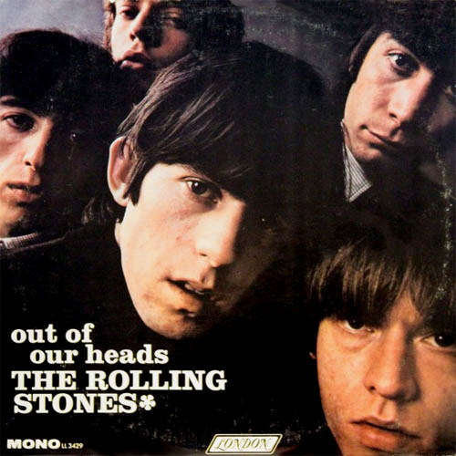

# Out Of Our Heads

By The Rolling Stones

## Album Data

[Discogs URL](https://www.discogs.com/release/4502220-The-Rolling-Stones-Out-Of-Our-Heads)

- Label: London Records
- Formats: Vinyl, LP, Album, Repress, Mono
- Genres: Rock, Blues, Pop Rock, Blues Rock, Rhythm & Blues
- Rating: 4.37
- Released: 1966
- Year: 1965
- Release ID: 4502220
- Media condition: 
- Sleeve condition: 
- Speed: 
- Weight: 
- Notes: 

## Album Tracks

| **Position** | **Title** | **Duration** |
|--------------|-----------|--------------|
| A1 | **Mercy Mercy** | 2:45 |
| A2 | **Hitch Hike** | 2:22 |
| A3 | **The Last Time** | 3:35 |
| A4 | **That's How Strong My Love Is** | 2:23 |
| A5 | **Good Times** | 1:57 |
| A6 | **I'm All Right** | 2:21 |
| B1 | **Satisfaction** | 3:45 |
| B2 | **Cry To Me** | 3:08 |
| B3 | **The Under Assistant West Coast Promotion Man** | 3:10 |
| B4 | **Play With Fire** | 2:15 |
| B5 | **The Spider And The Fly** | 3:30 |
| B6 | **One More Try** | 1:58 |

## Artist Roles

| **Name** | **Role** |
|----------|----------|
| **The Rolling Stones** | Arranged By [Arrangers] |
| **Bill Wyman** | Bass |
| **Phil Spector** | Bass [Zoom Bass] |
| **Charlie Watts** | Drums |
| **Dave Hassinger** | Engineer |
| **Glyn Johns** | Engineer |
| **Ron Malo** | Engineer |
| **Brian Jones (5)** | Guitar |
| **Keith Richards** | Guitar |
| **Brian Jones (5)** | Harmonica |
| **Mick Jagger** | Harmonica |
| **Andrew Loog Oldham** | Liner Notes |
| **Brian Jones (5)** | Organ, Piano, Harpsichord |
| **Ian Stewart** | Organ, Piano, Harpsichord |
| **Jack Nitzsche** | Organ, Piano, Harpsichord |
| **Charlie Watts** | Percussion |
| **Jack Nitzsche** | Percussion |
| **David Bailey (5)** | Photography By [Cover Photo] |
| **Andrew Loog Oldham** | Producer |
| **Keith Richards** | Vocals |
| **Mick Jagger** | Vocals |

