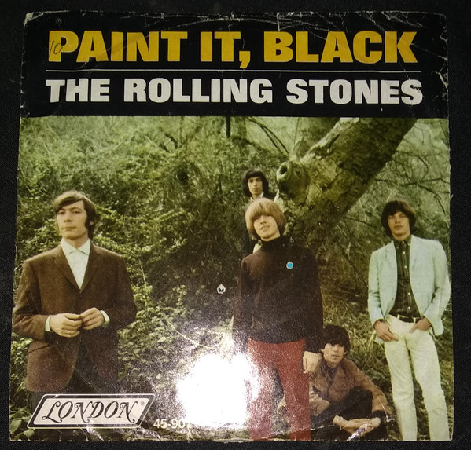

# Paint It, Black

By The Rolling Stones

## Album Data

[Discogs URL](https://www.discogs.com/release/8855242-The-Rolling-Stones-Paint-It-Black)

- Label: London Records
- Formats: Vinyl, 7", 45 RPM, Single
- Genres: Rock, Blues Rock, Garage Rock
- Rating: 3.88
- Released: 1966-05-13
- Year: 1966
- Release ID: 8855242
- Media condition: 
- Sleeve condition: 
- Speed: 
- Weight: 
- Notes: 

## Album Tracks

| **Position** | **Title** | **Duration** |
|--------------|-----------|--------------|
| A | **Paint It, Black** | 3:19 |
| B | **Stupid Girl** | 2:55 |

## Artist Roles

| **Name** | **Role** |
|----------|----------|
| **Dave Hassinger** | Engineer |
| **Andrew Loog Oldham** | Producer |
| **Jagger-Richards** | Written-By |

