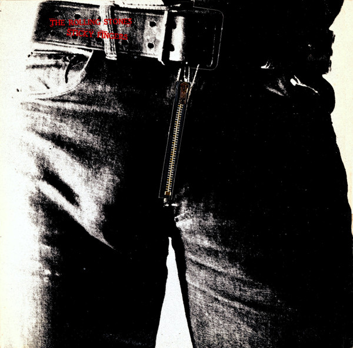

# Sticky Fingers

By The Rolling Stones

## Album Data

[Discogs URL](https://www.discogs.com/release/3635308-The-Rolling-Stones-Sticky-Fingers)

- Label: Rolling Stones Records
- Formats: Vinyl, LP, Album, Repress
- Genres: Rock, Blues Rock, Classic Rock
- Rating: 4.56
- Released: 1972
- Year: 1971
- Release ID: 3635308
- Media condition: 
- Sleeve condition: 
- Speed: 
- Weight: 
- Notes: 

## Album Tracks

| **Position** | **Title** | **Duration** |
|--------------|-----------|--------------|
| A1 | **Brown Sugar** | 3:50 |
| A2 | **Sway** | 3:45 |
| A3 | **Wild Horses** | 5:41 |
| A4 | **Can't You Hear Me Knocking** | 7:17 |
| A5 | **You Gotta Move** | 2:32 |
| B1 | **Bitch** | 3:42 |
| B2 | **I Got The Blues** | 4:00 |
| B3 | **Sister Morphine** | 5:34 |
| B4 | **Dead Flowers** | 4:05 |
| B5 | **Moonlight Mile** | 5:56 |

## Artist Roles

| **Name** | **Role** |
|----------|----------|
| **Andy Warhol** | Artwork [Cover] |
| **Jimmy Miller** | Producer |
| **Jagger-Richards** | Written-By |

