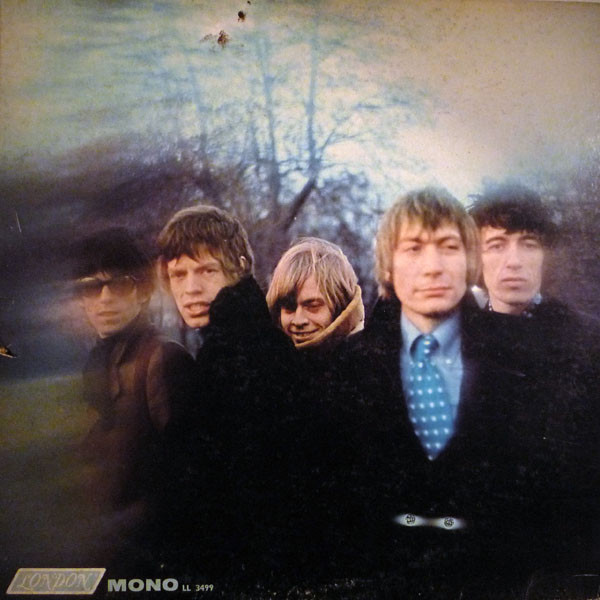

# Between The Buttons

By The Rolling Stones

## Album Data

[Discogs URL](https://www.discogs.com/release/2931906-The-Rolling-Stones-Between-The-Buttons)

- Label: London Records
- Formats: Vinyl, LP, Album, Mono
- Genres: Rock, Blues Rock, Pop Rock, Psychedelic Rock
- Rating: 4.35
- Released: 1967-02-11
- Year: 1967
- Release ID: 2931906
- Media condition: 
- Sleeve condition: 
- Speed: 
- Weight: 
- Notes: 

## Album Tracks

| **Position** | **Title** | **Duration** |
|--------------|-----------|--------------|
| A1 | **Let's Spend The Night Together** | 3:29 |
| A2 | **Yesterdays' Papers** | 2:20 |
| A3 | **Ruby Tuesday** | 3:12 |
| A4 | **Connection** | 2:13 |
| A5 | **She Smiled Sweetly** | 2:42 |
| A6 | **Cool, Calm & Collected** | 4:15 |
| B1 | **All Sold Out** | 2:15 |
| B2 | **My Obsession** | 3:20 |
| B3 | **Who's Been Sleeping Here?** | 3:51 |
| B4 | **Complicated** | 3:18 |
| B5 | **Miss Amanda Jones** | 2:48 |
| B6 | **Something Happened To Me Yesterday** | 4:58 |

## Artist Roles

| **Name** | **Role** |
|----------|----------|
| **The Rolling Stones** | Arranged By |
| **Charlie Watts** | Artwork [Drawings] |
| **Gered Mankowitz** | Photography By |
| **Andrew Loog Oldham** | Producer |
| **Jagger-Richards** | Written-By |

