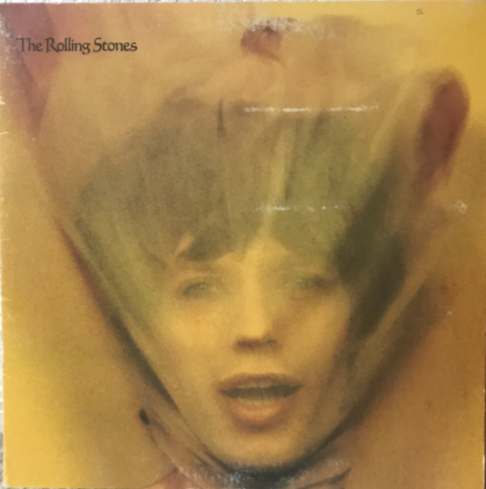

# Goats Head Soup

By The Rolling Stones

## Album Data

[Discogs URL](https://www.discogs.com/release/4792196-The-Rolling-Stones-Goats-Head-Soup)

- Label: Rolling Stones Records
- Formats: Vinyl, LP, Album, Stereo
- Genres: Rock, Classic Rock, Blues Rock
- Rating: 3.92
- Released: 1973-09-12
- Year: 1973
- Release ID: 4792196
- Media condition: 
- Sleeve condition: 
- Speed: 
- Weight: 
- Notes: 

## Album Tracks

| **Position** | **Title** | **Duration** |
|--------------|-----------|--------------|
| A1 | **Dancing With Mr. D.** | 4:52 |
| A2 | **100 Years Ago** | 4:00 |
| A3 | **Coming Down Again** | 5:55 |
| A4 | **Doo Doo Doo Doo Doo (Heartbreaker)** | 3:27 |
| A5 | **Angie** | 4:31 |
| B1 | **Silver Train** | 4:25 |
| B2 | **Hide Your Love** | 4:10 |
| B3 | **Winter** | 5:30 |
| B4 | **Can You Hear The Music** | 5:32 |
| B5 | **Star Star** | 4:25 |

## Artist Roles

| **Name** | **Role** |
|----------|----------|
| **Jim Price** | Arranged By [Horns] |
| **Nicky Harrison** | Arranged By [Strings] |
| **John Pasche** | Artwork [Goats Head Soup] |
| **Bill Wyman** | Bass |
| **Billy Preston** | Clavinet |
| **David Bailey (5)** | Design [Album], Photography By |
| **Ray Lawrence** | Design [Designer] |
| **Charlie Watts** | Drums |
| **Carlton Lee** | Engineer [Assistant] |
| **Doug Bennett** | Engineer [Assistant] |
| **Howard Kilgour** | Engineer [Assistant] |
| **Andy Johns** | Engineer [Chief], Mixed By |
| **Jim Horn** | Flute, Alto Saxophone |
| **Keith Richards** | Guitar, Bass, Vocals |
| **Mick Taylor** | Guitar, Bass, Vocals |
| **Jimmy Miller** | Percussion |
| **Nik Pascal** | Percussion |
| **Rebop Kwaku Baah** | Percussion |
| **Ian Stewart** | Performer [With Jangles] |
| **Billy Preston** | Piano |
| **Ian Stewart** | Piano |
| **Nicky Hopkins** | Piano |
| **Jimmy Miller** | Producer |
| **Jagger-Richards** | Songwriter |
| **Bobby Keys** | Tenor Saxophone, Baritone Saxophone |
| **Chuck Findley** | Trumpet |
| **Mick Jagger** | Vocals, Guitar, Blues Harp [Harp], Piano |

