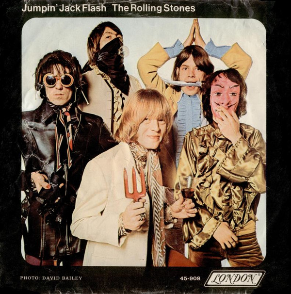

# Jumpin' Jack Flash

By The Rolling Stones

## Album Data

[Discogs URL](https://www.discogs.com/release/4958438-The-Rolling-Stones-Jumpin-Jack-Flash)

- Label: London Records
- Formats: Vinyl, 7", 45 RPM, Single
- Genres: Rock, Pop Rock, Psychedelic Rock
- Rating: 4.69
- Released: 1968-05-00
- Year: 1968
- Release ID: 4958438
- Media condition: 
- Sleeve condition: 
- Speed: 
- Weight: 
- Notes: 

## Album Tracks

| **Position** | **Title** | **Duration** |
|--------------|-----------|--------------|
| A | **Jumpin' Jack Flash** | 3:40 |
| B | **Child Of The Moon** | 3:08 |

## Artist Roles

| **Name** | **Role** |
|----------|----------|
| **The Rolling Stones** | Arranged By [Uncredited] |
| **Dominick Romeo** | Mastered By [Uncredited] |
| **Jimmy Miller** | Producer |
| **Jagger-Richards** | Written-By |

