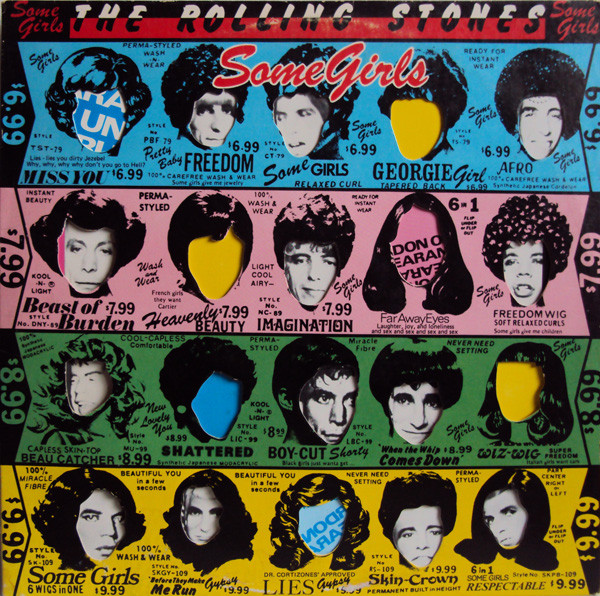

# Some Girls

By The Rolling Stones

## Album Data

[Discogs URL](https://www.discogs.com/release/5403804-The-Rolling-Stones-Some-Girls)

- Label: Rolling Stones Records
- Formats: Vinyl, LP, Album
- Genres: Rock, Blues Rock, Rock & Roll
- Rating: 4.2
- Released: 1978
- Year: 1978
- Release ID: 5403804
- Media condition: 
- Sleeve condition: 
- Speed: 
- Weight: 
- Notes: 

## Album Tracks

| **Position** | **Title** | **Duration** |
|--------------|-----------|--------------|
| A1 | **Miss You** | 4:50 |
| A2 | **When The Whip Comes Down** | 4:18 |
| A3 | **Just My Imagination (Running Away With Me)** | 4:25 |
| A4 | **Some Girls** | 4:40 |
| A5 | **Lies** | 3:12 |
| B1 | **Far Away Eyes** | 4:24 |
| B2 | **Respectable** | 3:05 |
| B3 | **Before They Make Me Run** | 3:26 |
| B4 | **Beast Of Burden** | 4:24 |
| B5 | **Shattered** | 3:43 |

## Artist Roles

| **Name** | **Role** |
|----------|----------|
| **Keith Richards** | Acoustic Guitar |
| **Ron Wood** | Acoustic Guitar |
| **Keith Richards** | Backing Vocals |
| **Mick Jagger** | Backing Vocals |
| **Ron Wood** | Backing Vocals |
| **Bill Wyman** | Bass |
| **Keith Richards** | Bass |
| **Ron Wood** | Bass |
| **Sugar Blue** | Blues Harp [Harp] |
| **Peter Corriston** | Design, Cover [Concept] |
| **Charlie Watts** | Drums |
| **Keith Richards** | Electric Guitar |
| **Mick Jagger** | Electric Guitar |
| **Ron Wood** | Electric Guitar |
| **Ian McLagan** | Electric Piano |
| **Barry Sage** | Engineer [Assistants] |
| **Ben King (2)** | Engineer [Assistants] |
| **Dave Jordan** | Engineer [Assistants] |
| **Philippe (8)** | Engineer [Assistants] |
| **Chris Kimsey** | Engineer, Mixed By |
| **Ted Jensen** | Lacquer Cut By |
| **Ron Wood** | Lead Guitar, Bass Drum |
| **Mick Jagger** | Lead Vocals |
| **Ted Jensen** | Mastered By |
| **Ian McLagan** | Organ [Hammond] |
| **Ron Wood** | Pedal Steel Guitar |
| **Keith Richards** | Piano |
| **The Glimmer Twins** | Producer |
| **Mel Collins** | Saxophone |
| **Ron Wood** | Slide Guitar |
| **Bill Wyman** | Synthesizer |
| **Charlie Watts** | Tom Tom |
| **Jagger-Richards** | Written-By |
| **Whitfield-Strong** | Written-By |

