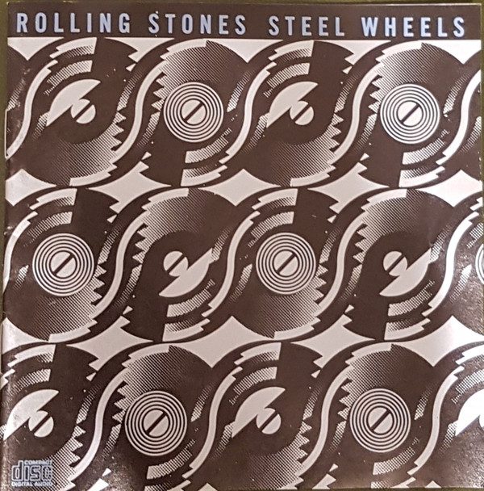

# Steel Wheels

By The Rolling Stones

## Album Data

[Discogs URL](https://www.discogs.com/release/7172125-Rolling-Stones-Steel-Wheels)

- Label: Rolling Stones Records
Rolling Stones Records
- Formats: Vinyl, LP, Album, Stereo
- Genres: Rock, Blues Rock, Hard Rock
- Rating: 4.01
- Released: 1989-08-29
- Year: 1989
- Release ID: 7172125
- Media condition: 
- Sleeve condition: 
- Speed: 
- Weight: 
- Notes: 

## Album Tracks

| **Position** | **Title** | **Duration** |
|--------------|-----------|--------------|
| A1 | **Sad Sad Sad** | 3:35 |
| A2 | **Mixed Emotions** | 4:37 |
| A3 | **Terrifying** | 4:50 |
| A4 | **Hold On To Your Hat** | 3:32 |
| A5 | **Hearts For Sale** | 4:38 |
| A6 | **Blinded By Love** | 4:37 |
| B1 | **Rock And A Hard Place** | 5:25 |
| B2 | **Can't Be Seen** | 4:08 |
| B3 | **Almost Hear You Sigh** | 4:33 |
| B4 | **Continental Drift** | 5:13 |
| B5 | **Break The Spell** | 3:06 |
| B6 | **Slipping Away** | 4:28 |

## Artist Roles

| **Name** | **Role** |
|----------|----------|
| **Ron Wood** | Acoustic Bass |
| **Keith Richards** | Acoustic Guitar |
| **Matt Clifford** | Arranged By |
| **Mick Jagger** | Arranged By |
| **The Kick Horns** | Arranged By [Horns] |
| **John Warwicker** | Art Direction, Design |
| **Vivid I.D.** | Art Direction, Design |
| **Bernard Fowler** | Backing Vocals |
| **Keith Richards** | Backing Vocals |
| **Lisa Fischer** | Backing Vocals |
| **Mick Jagger** | Backing Vocals |
| **Ron Wood** | Backing Vocals |
| **Sarah Dash** | Backing Vocals |
| **Sonia Morgan** | Backing Vocals |
| **Tessa Niles** | Backing Vocals |
| **Bill Wyman** | Bass |
| **Ron Wood** | Bass |
| **The Kick Horns** | Brass |
| **Matt Clifford** | Clavinet |
| **Q Prime Inc.** | Coordinator [Album] |
| **Tony King (13)** | Coordinator [Artwork] |
| **Janice Crotch** | Coordinator [Recording] |
| **Sherry Daly** | Coordinator [Recording] |
| **Ron Wood** | Dobro |
| **Charlie Watts** | Drums |
| **Matt Clifford** | Electric Piano |
| **Rupert Coulson** | Engineer [Assistant] |
| **Christopher Marc Potter** | Engineer [Recording] |
| **Phil Beer** | Fiddle |
| **Mark Norton (2)** | Graphics [Logo Design] |
| **Keith Richards** | Guitar |
| **Mick Jagger** | Guitar |
| **Ron Wood** | Guitar |
| **Mick Jagger** | Harmonica |
| **Matt Clifford** | Harmonium |
| **Farafina** | Instruments [African] |
| **Bachir Attar** | Instruments [Moroccan] |
| **Master Musicians Of Jajouka** | Instruments [Moroccan] |
| **Chuck Leavell** | Keyboards |
| **Matt Clifford** | Keyboards |
| **Mick Jagger** | Keyboards |
| **Ted Jensen** | Lacquer Cut By |
| **Keith Richards** | Lead Vocals |
| **Mick Jagger** | Lead Vocals |
| **Phil Beer** | Mandolin |
| **Ted Jensen** | Mastered By [DMM] |
| **Chris Kimsey** | Mixed By |
| **Christopher Marc Potter** | Mixed By |
| **Michael H. Brauer** | Mixed By |
| **Al Stone** | Mixed By [Assistants] |
| **Michael Butterworth** | Mixed By [Assistants] |
| **Matt Clifford** | Orchestrated By |
| **Chuck Leavell** | Organ |
| **Luis Jardim** | Percussion |
| **Enrique Badulescu** | Photography By |
| **Chuck Leavell** | Piano |
| **Matt Clifford** | Piano |
| **Chris Kimsey** | Producer |
| **The Glimmer Twins** | Producer |
| **Matt Clifford** | Programmed By [Percussion] |
| **Mick Jagger** | Shaker |
| **Keith Richards** | Sounds [Bicycle] |
| **Mat Clifford** | Strings |
| **Arnold Dunn** | Technician [Logistics, Morocco] |
| **Alan Dunn (2)** | Technician [Logistics] |
| **Roddy Lorimer** | Trumpet |
| **Chris Jagger** | Typography [Literary Editor] |
| **Mick Jagger** | Vocals |
| **Jagger-Richards** | Written-By |
| **Steve Jordan** | Written-By |

