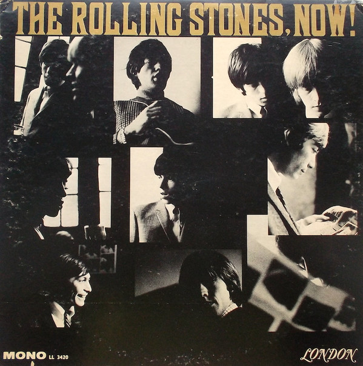

# The Rolling Stones, Now!

By The Rolling Stones

## Album Data

[Discogs URL](https://www.discogs.com/release/6648205-The-Rolling-Stones-The-Rolling-Stones-Now)

- Label: London Records
- Formats: Vinyl, LP, Album, Mono
- Genres: Rock, Blues Rock, Rock & Roll
- Rating: 4.19
- Released: 1965
- Year: 1965
- Release ID: 6648205
- Media condition: 
- Sleeve condition: 
- Speed: 
- Weight: 
- Notes: 

## Album Tracks

| **Position** | **Title** | **Duration** |
|--------------|-----------|--------------|
| A1 | **Everybody Needs Somebody To Love** | 2:57 |
| A2 | **Down Home Girl** | 4:15 |
| A3 | **You Can't Catch Me** | 4:30 |
| A4 | **Heart Of Stone** | 2:49 |
| A5 | **What A Shame** | 2:50 |
| A6 | **Mona (I Need You Baby)** | 3:55 |
| B1 | **Down The Road Apiece** | 3:00 |
| B2 | **Off The Hook** | 2:35 |
| B3 | **Pain In My Heart** | 2:12 |
| B4 | **Oh Baby (We Got A Good Thing Goin')** | 2:06 |
| B5 | **Little Red Rooster** | 3:00 |
| B6 | **Surprise, Surprise** | 2:20 |

## Artist Roles

| **Name** | **Role** |
|----------|----------|
| **The Rolling Stones** | Arranged By |
| **Andrew Loog Oldham** | Liner Notes |
| **David Bailey (5)** | Photography By |
| **Andrew Loog Oldham** | Producer |

