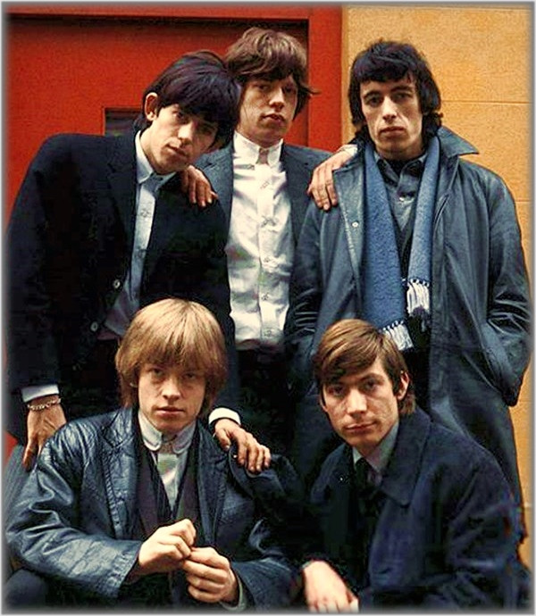

# The Rolling Stones

## Artist Profile

English rock band formed in London in May 1962. They are one of the longest-lived and most commercially successful groups in rock history. Inducted into the Rock And Roll Hall of Fame in 1989 (Performer).

Band members

05/1962 - 05/1963
Ian Stewart (Keyboards, piano)

05/1962 - 06/1969
Brian Jones (5) (Lead and rhythm guitars)

06/1962 - 10/1962
Dick Taylor (2) (Bass)

06/1962 - 12/1962
Tony Chapman (Drums)

06/1962 - present
Mick Jagger (Lead vocals, harmonica, percussion)
Keith Richards (Lead and rhythm guitars, acoustic guitar, backing vocals)

12/1962 - 01/1993
Bill Wyman (Bass)

01/1963 - 08/2021
Charlie Watts (Drums and percussion)

07/1969 - 12/1974
Mick Taylor (Lead and slide guitars)

03/1975 - present
Ron Wood (Guitars, backing vocals)

## Artist Links

- [https://rollingstones.com/](https://rollingstones.com/)
- [https://www.facebook.com/therollingstones](https://www.facebook.com/therollingstones)
- [https://twitter.com/RollingStones](https://twitter.com/RollingStones)
- [https://www.instagram.com/therollingstones/](https://www.instagram.com/therollingstones/)
- [https://myspace.com/therollingstones](https://myspace.com/therollingstones)
- [https://rollingstonesofficial.tumblr.com/](https://rollingstonesofficial.tumblr.com/)
- [https://rollingstones.fandom.com/wiki/Home](https://rollingstones.fandom.com/wiki/Home)
- [https://www.youtube.com/user/TheRollingStones](https://www.youtube.com/user/TheRollingStones)
- [https://www.youtube.com/user/TheRollingStonesVEVO](https://www.youtube.com/user/TheRollingStonesVEVO)
- [https://soundcloud.com/rolling-stones-official](https://soundcloud.com/rolling-stones-official)
- [https://www.last.fm/music/The+Rolling+Stones](https://www.last.fm/music/The+Rolling+Stones)
- [https://www.universal-music.de/rolling-stones](https://www.universal-music.de/rolling-stones)
- [https://rocksoff.org/](https://rocksoff.org/)
- [https://iorr.org/](https://iorr.org/)
- [http://sympathyforthedevils.com/](http://sympathyforthedevils.com/)
- [http://keno.org/Home.html](http://keno.org/Home.html)
- [https://www.stonesnofilter.co.uk/](https://www.stonesnofilter.co.uk/)
- [https://www.timeisonourside.com/](https://www.timeisonourside.com/)
- [https://stones7.com](https://stones7.com)
- [https://www.stonesondecca.com/basic-lp-info/decca-inner-bags/](https://www.stonesondecca.com/basic-lp-info/decca-inner-bags/)
- [https://en.wikipedia.org/wiki/The_Rolling_Stones](https://en.wikipedia.org/wiki/The_Rolling_Stones)
- [https://www.britannica.com/topic/the-Rolling-Stones](https://www.britannica.com/topic/the-Rolling-Stones)
- [https://web.archive.org/web/20021119181623/http://classicwebs.com/rstones.htm](https://web.archive.org/web/20021119181623/http://classicwebs.com/rstones.htm)
- [https://www.bbc.co.uk/music/artists/b071f9fa-14b0-4217-8e97-eb41da73f598](https://www.bbc.co.uk/music/artists/b071f9fa-14b0-4217-8e97-eb41da73f598)
- [https://musicianbio.org/the-rolling-stones/](https://musicianbio.org/the-rolling-stones/)
- [https://www.musicianguide.com/biographies/1608002197/The-Rolling-Stones.html](https://www.musicianguide.com/biographies/1608002197/The-Rolling-Stones.html)
- [https://www.musicianguide.com/featured_biographies/collection/7/Rolling-Stones.html](https://www.musicianguide.com/featured_biographies/collection/7/Rolling-Stones.html)
- [https://www.whosampled.com/The-Rolling-Stones/](https://www.whosampled.com/The-Rolling-Stones/)
- [https://genius.com/artists/The-rolling-stones](https://genius.com/artists/The-rolling-stones)
- [https://www.imdb.com/name/nm1213869/](https://www.imdb.com/name/nm1213869/)

## See also

- [12 x 5](12_x_5.md)
- [Aftermath](Aftermath.md)
- [Between The Buttons](Between_The_Buttons.md)
- [England's Newest Hit Makers](Englands_Newest_Hit_Makers.md)
- [Goats Head Soup](Goats_Head_Soup.md)
- [Got Live If You Want It!](Got_Live_If_You_Want_It!.md)
- [It's Only Rock 'N Roll](Its_Only_Rock_N_Roll.md)
- [Jumpin' Jack Flash](Jumpin_Jack_Flash.md)
- [Out Of Our Heads](Out_Of_Our_Heads.md)
- [Paint It, Black](Paint_It__Black.md)
- [Some Girls](Some_Girls.md)
- [Steel Wheels](Steel_Wheels.md)
- [Sticky Fingers](Sticky_Fingers.md)
- [The Rolling Stones, Now!](The_Rolling_Stones__Now!.md)
- [Through The Past, Darkly (Big Hits Vol. 2)](Through_The_Past__Darkly_Big_Hits_Vol_2.md)
