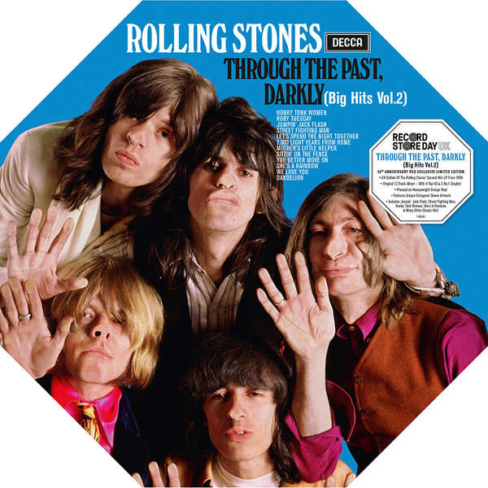

# Through The Past, Darkly (Big Hits Vol. 2)

By The Rolling Stones

## Album Data

[Discogs URL](https://www.discogs.com/release/936330-Rolling-Stones-Through-The-Past-Darkly-Big-Hits-Vol-2)

- Label: London Records
- Formats: Vinyl, LP, Compilation, Stereo
- Genres: Rock, Blues Rock, Classic Rock
- Rating: 4.29
- Released: 1969
- Year: 1969
- Release ID: 936330
- Media condition: 
- Sleeve condition: 
- Speed: 
- Weight: 
- Notes: 

## Album Tracks

| **Position** | **Title** | **Duration** |
|--------------|-----------|--------------|
| A1 | **Paint It, Black** | 3:20 |
| A2 | **Ruby Tuesday** | 3:12 |
| A3 | **She's A Rainbow** | 4:35 |
| A4 | **Jumpin' Jack Flash** | 3:40 |
| A5 | **Mother's Little Helper** | 2:40 |
| A6 | **Let's Spend The Night Together** | 3:29 |
| B1 | **Honky Tonk Women** | 3:03 |
| B2 | **Dandelion** | 3:56 |
| B3 | **2,000 Light Years From Home** | 4:45 |
| B4 | **Have You Seen Your Mother Baby, Standing In The Shadow?** | 2:33 |
| B5 | **Street Fighting Man** | 3:10 |

## Artist Roles

| **Name** | **Role** |
|----------|----------|
| **The Rolling Stones** | Arranged By |
| **Sam Feldman** | Lacquer Cut By |
| **Ethan Russell** | Photography By [Cover And Liner Photographs] |
| **Andrew Loog Oldham** | Producer |
| **Jimmy Miller** | Producer |
| **The Rolling Stones** | Producer |
| **Jagger-Richards** | Written-By |

