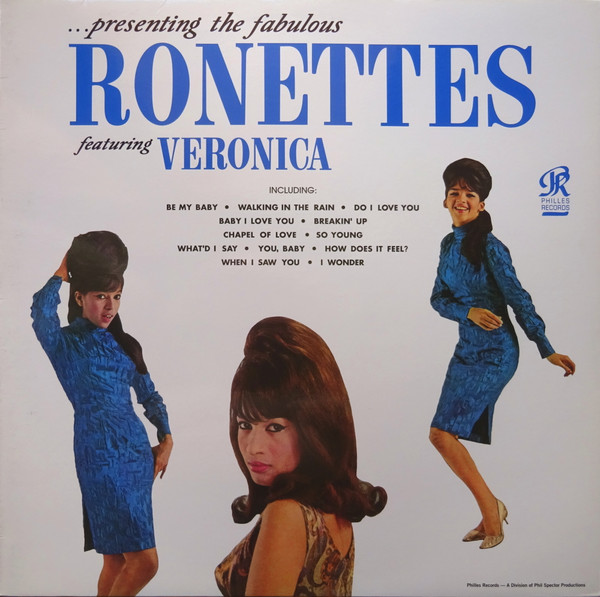

# Presenting The Fabulous Ronettes Featuring Veronica

By The Ronettes

## Album Data

[Discogs URL](https://www.discogs.com/release/4195144-The-Ronettes-Featuring-Veronica-Presenting-The-Fabulous-RonettesFeaturing-Veronica)

- Label: Philles Records
Music On Vinyl
- Formats: Vinyl, LP, Album, Reissue, Mono
- Genres: Pop, Rhythm & Blues
- Rating: 4.43
- Released: 2013-01-17
- Year: 1964
- Release ID: 4195144
- Media condition: 
- Sleeve condition: 
- Speed: 
- Weight: 
- Notes: 

## Album Tracks

| **Position** | **Title** | **Duration** |
|--------------|-----------|--------------|
| A1 | **Walking In The Rain ** | 2:35 |
| A2 | **Do I Love You? ** | 2:30 |
| A3 | **So Young ** | 2:34 |
| A4 | **(The Best Part Of) Breakin' Up ** | 2:40 |
| A5 | **I Wonder ** | 2:35 |
| A6 | **What'd I Say? ** | 4:40 |
| B1 | **Be My Baby ** | 2:39 |
| B2 | **You, Baby ** | 2:35 |
| B3 | **Baby, I Love You ** | 2:49 |
| B4 | **How Does It Feel? ** | 2:38 |
| B5 | **When I Saw You** | 2:30 |
| B6 | **Chapel Of Love** | 2:54 |

## Artist Roles

| **Name** | **Role** |
|----------|----------|
| **Jack Nitzsche** | Arranged By |
| **Jimmy Bond** | Bass |
| **Larry Knechtel** | Bass |
| **Ray Pohlman** | Bass |
| **Hal Blaine** | Drums |
| **Larry Levine** | Engineer, Sleeve Notes |
| **Barney Kessel** | Guitar |
| **Bill Pitman** | Guitar |
| **Carol Kaye** | Guitar |
| **Tommy Tedesco** | Guitar |
| **Vini Poncia** | Guitar |
| **Jay Migliori** | Horns |
| **Lou Blackburn** | Horns |
| **Roy Caton** | Horns |
| **Steve Douglas** | Horns |
| **Al De Lory** | Piano |
| **Don Randi** | Piano |
| **Harold Battiste** | Piano |
| **Larry Knechtel** | Piano |
| **Leon Russell** | Piano |
| **Phil Spector** | Producer |

