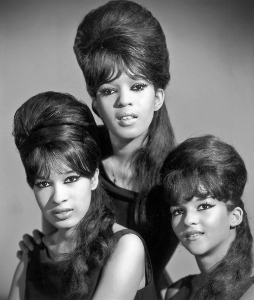

# The Ronettes

## Artist Profile

The group started life as the Darling Sisters shortly after being renamed Ronnie and the Relatives by Estelle and Veronica's mother, Bernice Bennett and eventually reinventing themselves as The Ronettes.
Inducted into Rock And Roll Hall of Fame in 2007 (Performer).

## Artist Links

- [https://en.wikipedia.org/wiki/The_Ronettes](https://en.wikipedia.org/wiki/The_Ronettes)
- [https://www.imdb.com/name/nm2012763/](https://www.imdb.com/name/nm2012763/)

## See also

- [Presenting The Fabulous Ronettes Featuring Veronica](Presenting_The_Fabulous_Ronettes Featuring_Veronica.md)
