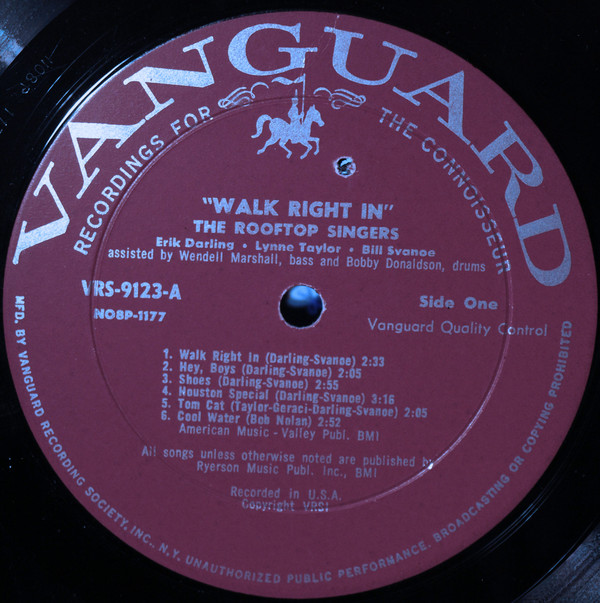

# Walk Right In

By The Rooftop Singers

## Album Data

[Discogs URL](https://www.discogs.com/release/1326398-The-Rooftop-Singers-Walk-Right-In)

- Label: Vanguard
- Formats: Vinyl, 7", 45 RPM, Single
- Genres: Rock, Folk, World, & Country, Folk Rock
- Rating: 3.41
- Released: 1962
- Year: 1962
- Release ID: 1326398
- Media condition: 
- Sleeve condition: 
- Speed: 
- Weight: 
- Notes: 

## Album Tracks

| **Position** | **Title** | **Duration** |
|--------------|-----------|--------------|
| A | **Walk Right In** | 2:32 |
| B | **Cool Water** | 2:50 |

