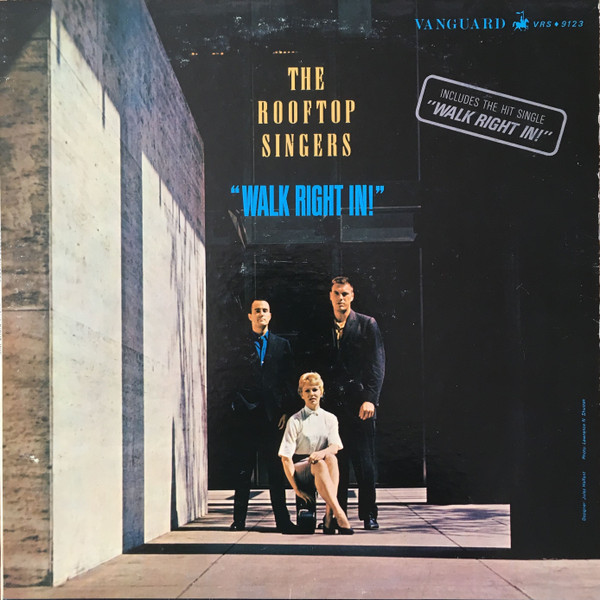

# Walk Right In!

By The Rooftop Singers

## Album Data

[Discogs URL](https://www.discogs.com/release/1940392-The-Rooftop-Singers-Walk-Right-In)

- Label: Vanguard
- Formats: Vinyl, LP, Album, Mono
- Genres: Jazz, Pop, Folk, World, & Country, Folk Rock, Folk
- Rating: 4.29
- Released: 1963-01-00
- Year: 1963
- Release ID: 1940392
- Media condition: 
- Sleeve condition: 
- Speed: 
- Weight: 
- Notes: 

## Album Tracks

| **Position** | **Title** | **Duration** |
|--------------|-----------|--------------|
| A1 | **Walk Right In** | 2:33 |
| A2 | **Hey Boys** | 2:05 |
| A3 | **Shoes** | 2:55 |
| A4 | **Houston Special** | 3:16 |
| A5 | **Tom Cat** | 2:05 |
| A6 | **Cool Water** | 2:52 |
| B1 | **Somebody Came Home** | 2:08 |
| B2 | **You Don't Know** | 2:26 |
| B3 | **Stagolee** | 3:12 |
| B4 | **Rained Five Days** | 2:53 |
| B5 | **Ham And Eggs** | 2:29 |
| B6 | **Ha Ha Thisaway** | 1:31 |
| B7 | **Brandy Leave Me Alone** | 2:14 |

## Artist Roles

| **Name** | **Role** |
|----------|----------|
| **Wendell Marshall** | Bass |
| **Bobby Donaldson** | Drums |
| **Erik Darling** | Guitar [12-string] |
| **Willard Svanoe** | Guitar [12-string] |
| **Erik Darling** | Vocals |
| **Lynne Taylor** | Vocals |
| **Willard Svanoe** | Vocals |
| **Erik Darling** | Written-By |
| **Lynne Taylor** | Written-By |
| **Willard Svanoe** | Written-By |

