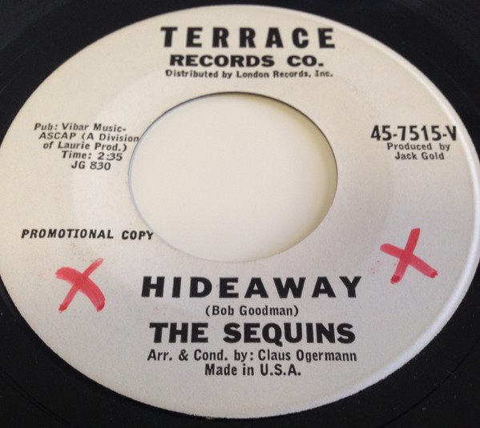

# Hideaway

By The Sequins

## Album Data

[Discogs URL](https://www.discogs.com/release/8980610-The-Sequins-Hideaway)

- Label: Terrace Records Co.
- Formats: Vinyl, 7", 45 RPM, Single, Promo
- Genres: Funk / Soul, Rhythm & Blues, Soul
- Rating: 3.5
- Released: null
- Year: 1963
- Release ID: 8980610
- Media condition: 
- Sleeve condition: 
- Speed: 
- Weight: 
- Notes: 

## Album Tracks

| **Position** | **Title** | **Duration** |
|--------------|-----------|--------------|
| A | **Hideaway** | 2:35 |
| B | **I Ain't Gonna Cry (No More)** | 2:12 |

## Artist Roles

| **Name** | **Role** |
|----------|----------|
| **Garry Sherman** | Arranged By, Conductor |
| **Jack Gold** | Producer |

