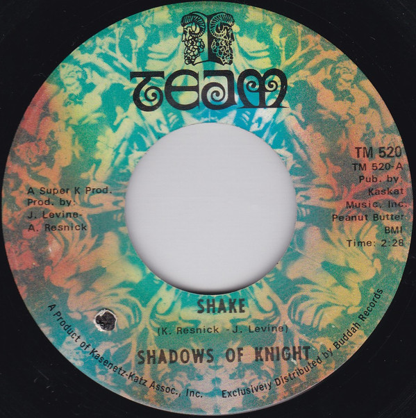

# Shake

By The Shadows Of Knight

## Album Data

[Discogs URL](https://www.discogs.com/release/7362584-Shadows-Of-Knight-Shake)

- Label: Team
- Formats: Vinyl, 7", 45 RPM
- Genres: Rock, Garage Rock, Psychedelic Rock
- Rating: 4.67
- Released: 1968-09-00
- Year: 1969
- Release ID: 7362584
- Media condition: 
- Sleeve condition: 
- Speed: 
- Weight: 
- Notes: 

## Album Tracks

| **Position** | **Title** | **Duration** |
|--------------|-----------|--------------|
| A | **Shake** | 2:28 |
| B | **From Way Out To Way Under** | 2:45 |

## Artist Roles

| **Name** | **Role** |
|----------|----------|
| **Arthur Resnick** | Producer [Prod. By] |
| **Joey Levine** | Producer [Prod. By] |

