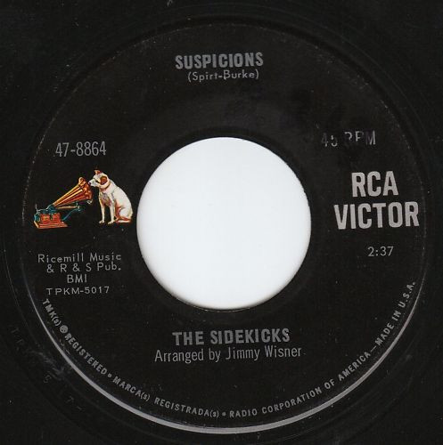

# Suspicions

By The Sidekicks

## Album Data

[Discogs URL](https://www.discogs.com/release/2671740-The-Sidekicks-Suspicions)

- Label: RCA Victor
- Formats: Vinyl, 7", 45 RPM, Single
- Genres: Rock, Pop, Garage Rock, Pop Rock
- Rating: 3.33
- Released: 1966-09-00
- Year: 1966
- Release ID: 2671740
- Media condition: 
- Sleeve condition: 
- Speed: 
- Weight: 
- Notes: 

## Album Tracks

| **Position** | **Title** | **Duration** |
|--------------|-----------|--------------|
| A | **Suspicions** | 2:37 |
| V | **Up On The Roof** | 2:34 |

## Artist Roles

| **Name** | **Role** |
|----------|----------|
| **Jimmy Wisner** | Arranged By |

