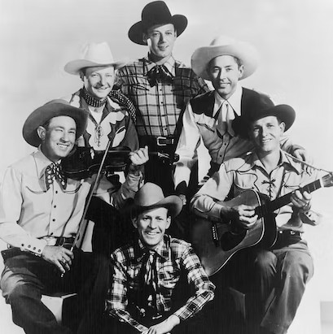

# The Sons Of The Pioneers

## Artist Profile

The Sons of the Pioneers are one of America's earliest Western singing groups whose classic recordings set a new standard for performers of Western music. Known for the high quality of their vocal performances, musicianship, and songwriting, they produced finely-crafted and innovative recordings that have inspired many Western music performers and remained popular through the years. Since 1933, through many changes in membership, the Sons of the Pioneers have remained one of the longest-surviving country music vocal groups in history.

## Artist Links

- [http://www.sonsofthepioneers.org/](http://www.sonsofthepioneers.org/)
- [http://www.facebook.com/SonsofthePioneers/](http://www.facebook.com/SonsofthePioneers/)
- [http://www.last.fm/music/Sons+Of+The+Pioneers](http://www.last.fm/music/Sons+Of+The+Pioneers)
- [http://en.wikipedia.org/wiki/Sons_of_the_Pioneers](http://en.wikipedia.org/wiki/Sons_of_the_Pioneers)

## See also

- [Maverick](Maverick.md)
