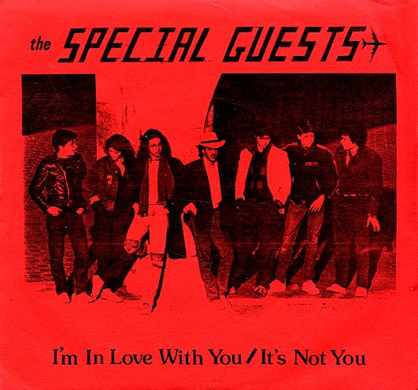

# I'm In Love With You / It's Not You

By The Special Guests

## Album Data

[Discogs URL](https://www.discogs.com/release/8784286-The-Special-Guests-Im-In-Love-With-You-Its-Not-You)

- Label: Special Guests Enterprises
- Formats: Vinyl, 7", 45 RPM, Promo, Stereo
- Genres: Rock, Pop, Indie Pop, New Wave, Ska
- Rating: 0
- Released: 1986
- Year: 1986
- Release ID: 8784286
- Media condition: 
- Sleeve condition: 
- Speed: 
- Weight: 
- Notes: 

## Album Tracks

| **Position** | **Title** | **Duration** |
|--------------|-----------|--------------|
| A | **I'm In Love With You** | 1:49 |
| B | **It's Not You** | 3:03 |

## Artist Roles

| **Name** | **Role** |
|----------|----------|
| **Steve Greenfield** | Alto Saxophone, Vocals |
| **Paul Foglino** | Bass |
| **The Special Guests (3)** | Design [Cover] |
| **Dave Helberg** | Drums |
| **Kramer (2)** | Engineer |
| **Mark Ettinger (2)** | Keyboards, Vocals |
| **Joe Brescio** | Lacquer Cut By |
| **Wally Griffith** | Lead Guitar |
| **Tom Meltzer** | Lead Vocals, Rhythm Guitar |
| **Samantha McCormick** | Photography By |
| **Kramer (2)** | Producer |
| **Ted Houghton** | Producer |
| **Jennifer Collins (2)** | Tenor Saxophone |

