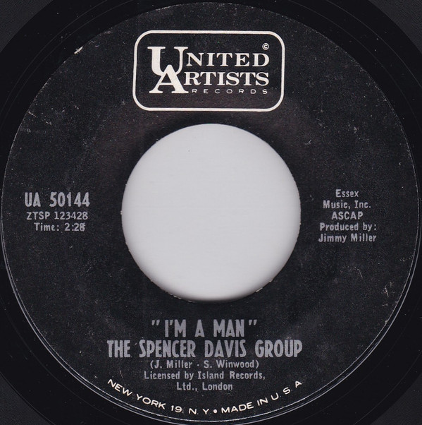

# I'm A Man

By The Spencer Davis Group

## Album Data

[Discogs URL](https://www.discogs.com/release/1802025-The-Spencer-Davis-Group-Im-A-Man)

- Label: United Artists Records
- Formats: Vinyl, 7", 45 RPM
- Genres: Rock, Rhythm & Blues
- Rating: 4.52
- Released: 1967
- Year: 1967
- Release ID: 1802025
- Media condition: 
- Sleeve condition: 
- Speed: 
- Weight: 
- Notes: 

## Album Tracks

| **Position** | **Title** | **Duration** |
|--------------|-----------|--------------|
| A | **I'm A Man** | 2:28 |
| B | **I Can't Get Enough Of It** | 3:42 |

## Artist Roles

| **Name** | **Role** |
|----------|----------|
| **Jimmy Miller** | Producer |
| **Jimmy Miller** | Written-By |
| **Steve Winwood** | Written-By |

