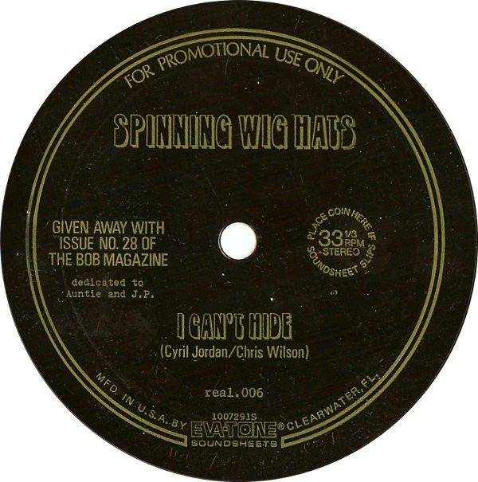

# I Can't Hide

By The Spinning Wighats

## Album Data

[Discogs URL](https://www.discogs.com/release/3440762-Spinning-Wig-Hats-I-Cant-Hide)

- Label: The Bob Magazine
- Formats: Flexi-disc, 7", 33 ⅓ RPM, Promo, Single Sided
- Genres: Rock, Garage Rock
- Rating: 3.17
- Released: 1986
- Year: 1986
- Release ID: 3440762
- Media condition: 
- Sleeve condition: 
- Speed: 
- Weight: 
- Notes: 

## Album Tracks

| **Position** | **Title** | **Duration** |
|--------------|-----------|--------------|
| A | **I Can't Hide** |  |

## Artist Roles

| **Name** | **Role** |
|----------|----------|
| **Chris Wilson (3)** | Written-By |
| **Cyril Jordan** | Written-By |

