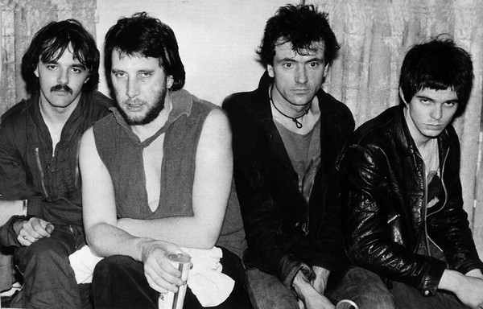

# The Stranglers

## Artist Profile

English rock band (New Wave, Punk, Rock), formed as the Guildford Stranglers on 11 September 1974 in Guildford, Surrey, UK.
Originally comprised of Hugh Cornwell (vocals, guitar), J.J. Burnel (bass, vocals), Brian Duffy aka Jet Black (drums) and Hans Wärmling (keys); Wärmling left the band when he moved back to Sweden in 1975 and was replaced with Dave Greenfield. The Stranglers' early sound was driven by Burnel's melodic bass, but also gave prominence to Greenfield's keyboards. Their early music was also characterised by the growling vocals and sometimes misanthropic lyrics of both Burnel and Cornwell.
Briefly, in 1977, the band would be billed as the Mutations, where they would be fronted by vocalist Celia Gollin. This only lasted one single; by the time the second single had released, only Burnel was still in the Mutations, featuring only on the A-side.
Cornwell left in 1990 to pursue a solo career, being replaced by Paul Roberts on vocals and John Ellis on guitar. During live gigs in this era, Roberts sung tracks traditionally performed by Burnel. Ellis left the band in 2000, passing the reigns to guitarist Baz Warne; when Roberts left the group in 2006 over disagreements during the recording of Suite XVI, Warne was promoted to lead vocalist also, rerecording the tracks already recorded by Roberts alongside Burnel.
Jet Black started experiencing health issues in 2007 that caused him to miss gigs; technician Ian Barnard played in such instances. Black's live role was lessened in the 2013 tour, with Jim Macaulay playing the first halves of UK gigs and solely playing US gigs. Black played no gigs following March 2015, officially retiring in 2018; Macaulay's role as Black's replacement was officiated in 2016.
After contracting COVID-19 in hospital, Dave Greenfield died on the 3rd of May 2020. Following the release of Dark Matters, Toby Hounsham became the band's new keyboardist for their final full tour in 2021-2022.

## Artist Links

- [http://www.thestranglers.co.uk/](http://www.thestranglers.co.uk/)
- [http://www.stranglers.org.uk/index.htm](http://www.stranglers.org.uk/index.htm)
- [http://en.wikipedia.org/wiki/The_Stranglers](http://en.wikipedia.org/wiki/The_Stranglers)
- [https://www.facebook.com/thestranglers/](https://www.facebook.com/thestranglers/)
- [https://myspace.com/thestranglers](https://myspace.com/thestranglers)
- [http://www.musikalske.net/the_stranglers/the_stranglers.htm](http://www.musikalske.net/the_stranglers/the_stranglers.htm)

## See also

- [Feline](Feline.md)
