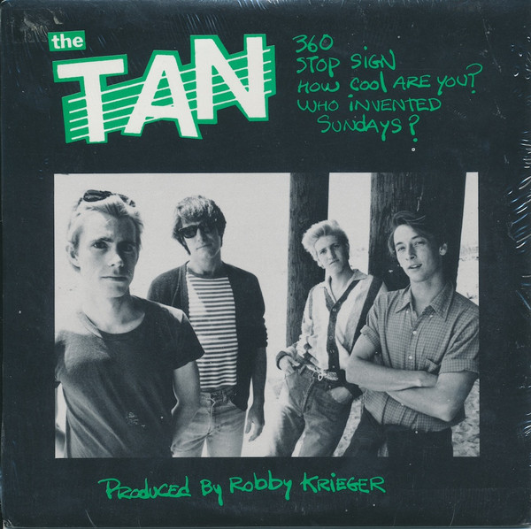

# 360

By The Tan

## Album Data

[Discogs URL](https://www.discogs.com/release/4015312-The-Tan-360)

- Label: Not On Label
- Formats: Vinyl, 7", 33 ⅓ RPM, EP, Reissue
- Genres: Rock, Power Pop, Punk, New Wave
- Rating: 4.67
- Released: 1981
- Year: 1981
- Release ID: 4015312
- Media condition: 
- Sleeve condition: 
- Speed: 
- Weight: 
- Notes: 

## Album Tracks

| **Position** | **Title** | **Duration** |
|--------------|-----------|--------------|
| A1 | **360** |  |
| A2 | **Stop Sign** |  |
| B1 | **How Cool Are You** |  |
| B2 | **Who Invented Sundays** |  |

