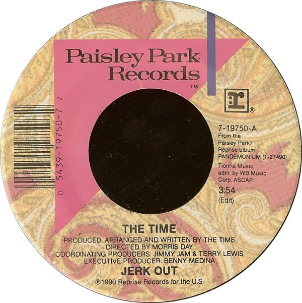

# Jerk Out

By The Time

## Album Data

[Discogs URL](https://www.discogs.com/release/570937-The-Time-Jerk-Out)

- Label: Paisley Park
- Formats: Vinyl, 7", Single
- Genres: Funk / Soul, Funk
- Rating: 4.29
- Released: 1990
- Year: 1990
- Release ID: 570937
- Media condition: 
- Sleeve condition: 
- Speed: 
- Weight: 
- Notes: 

## Album Tracks

| **Position** | **Title** | **Duration** |
|--------------|-----------|--------------|
| A | **Jerk Out (Edit)** | 3:54 |
| B | **Mo' Jerk Out** | 4:30 |

## Artist Roles

| **Name** | **Role** |
|----------|----------|
| **Morris Day** | Directed By |
| **Benny Medina** | Executive Producer |
| **Jimmy Jam & Terry Lewis** | Producer [Coordinating Producer] |
| **The Time** | Producer [Produced By], Written By, Arranged By |

