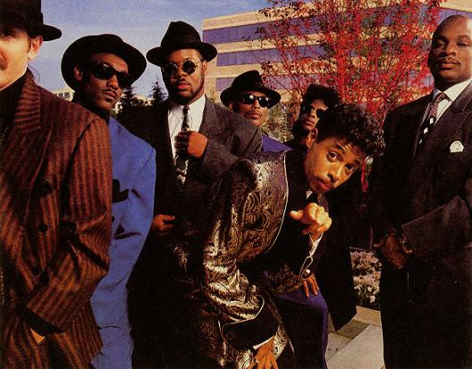

# The Time

## Artist Profile

Born in Minneapolis, the group featured keyboardist Jimmy 'Jam' Harris, bassist Terry Lewis, vocalist Morris Day, keyboardist Monte Moir, guitarist Jesse Johnson, and drummer Jellybean Johnson, all from two Twin Cities funk units, Flyte Tyme and "Enterprise". The band's first Warner Bros. album, 1981's The Time, was created almost single-handedly by Prince (who wrote and played on tracks he produced under the early pseudonym Jamie Starr), Day, who performed the lead vocals, and Johnson, who played some guitar. By 1982, the year of "777-9311", from '82 Warner Bros. album "What Time Is It?", the group had already established itself as one of the hottest bands working the live circuit. The original members reunited in 1990 for the album "Pandemonium" on Paisley Park label and released the single "Jerk Out". Despite expectations, the reunion only brought moderate success.

## Artist Links

- [http://www.princevault.com/index.php?title=The_Time](http://www.princevault.com/index.php?title=The_Time)
- [http://en.wikipedia.org/wiki/The_Time_(band)](http://en.wikipedia.org/wiki/The_Time_(band))
- [https://twitter.com/theoriginal7ven](https://twitter.com/theoriginal7ven)

## See also

- [Jerk Out](Jerk_Out.md)
