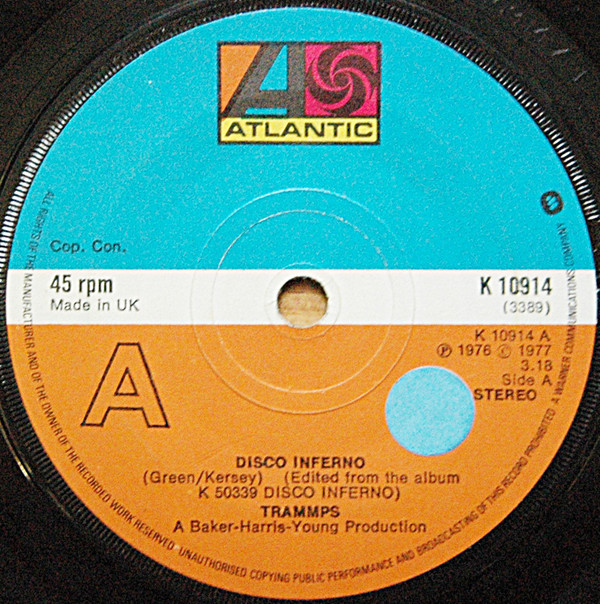

# Disco Inferno

By The Trammps

## Album Data

[Discogs URL](https://www.discogs.com/release/2975238-The-Trammps-Disco-Inferno)

- Label: Atlantic
- Formats: Vinyl, 7", 45 RPM
- Genres: Funk / Soul, Disco
- Rating: 4.22
- Released: 1977-02-10
- Year: 1977
- Release ID: 2975238
- Media condition: 
- Sleeve condition: 
- Speed: 
- Weight: 
- Notes: 

## Album Tracks

| **Position** | **Title** | **Duration** |
|--------------|-----------|--------------|
| A | **Disco Inferno** | 3:35 |
| B | **You Touch My Hot Line** | 4:23 |

## Artist Roles

| **Name** | **Role** |
|----------|----------|
| **Tom Moulton & José Rodriguez** | Mastered By [Etched] |
| **Tom Moulton** | Mixed By |
| **B-H-Y** | Producer |

