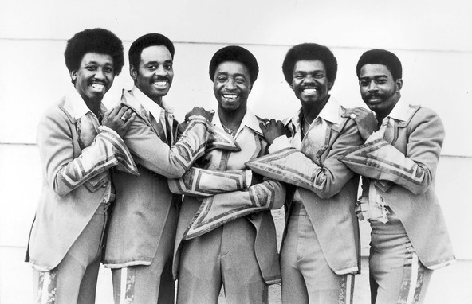

# The Trammps

## Artist Profile

Disco's most soulful vocal group began in 1960s Philadelphia as The Volcanos (2), and were also called The Moods. Gene Faith was the original lead vocalist, with Earl Young, Jimmy Ellis (2), guitarist Dennis Harris, keyboardist Ron Kersey, organist John Hart (9), bassist Stanley Wade, and drummer Michael Thomas. But by the time they'd gone through various identities and emerged as the Trammps in the mid-1970's, the lineup featured lead vocalist Ellis, Harold Wade and Stanley Wade, Robert Upchurch, and Young.

## Artist Links

- [http://www.thetrammps.net/](http://www.thetrammps.net/)
- [https://www.thetrammpswithearlyoung.com/](https://www.thetrammpswithearlyoung.com/)
- [https://en.wikipedia.org/wiki/The_Trammps](https://en.wikipedia.org/wiki/The_Trammps)
- [http://www.soulwalking.co.uk/Trammps.html](http://www.soulwalking.co.uk/Trammps.html)
- [https://www.whosampled.com/The-Trammps/Rubber-Band/](https://www.whosampled.com/The-Trammps/Rubber-Band/)
- [https://www.facebook.com/The-Trammps-Fan-Page-194783673922055/](https://www.facebook.com/The-Trammps-Fan-Page-194783673922055/)

## See also

- [Disco Inferno](Disco_Inferno.md)
