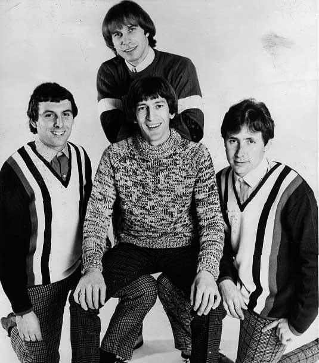

# The Troggs

## Artist Profile

English rock band formed in Andover, Hampshire in 1964.

Reg Presley: Vocals & Ocarina
Chris Britton: Guitar
Peter Staples: Bass
Ronnie Bond: Drums

## Artist Links

- [http://www.thetroggs.co.uk/#!bio/c24vq](http://www.thetroggs.co.uk/#!bio/c24vq)
- [http://en.wikipedia.org/wiki/The_Troggs](http://en.wikipedia.org/wiki/The_Troggs)

## See also

- [I Can't Control Myself](I_Cant_Control_Myself.md)
