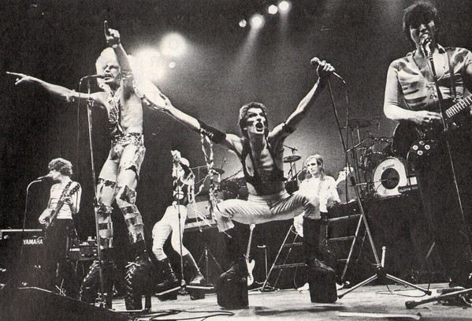

# The Tubes

## Artist Profile

The Tubes are a San Francisco-based rock band that used a mix of progressive rock theater, multimedia, and scathing social criticism of America's television culture. The original line up consisted of Fee Waybill (Vocals), Rick Anderson (Bass), Prairie Prince (Drums), Roger Steen (Guitar and Vocals), Bill Spooner (Guitar and Vocals), Vince Welnick (Keyboards), and Michael Cotten (Synthesizer). Their live performances were surreal vaudeville shows in which songs became full fledged production numbers. 

The Tubes scored their first hit "White Punks on Dope," on their self-titled debut album released on A&M records. Their second album, “Young And Rich," included their second hit single – the suggestive duet “Don't Touch Me There." The Tubes released three more albums on A&M before being dropped in 1982. Capitol Records signed them upon their release from A&M and they released their most successful album to date, the concept album “The Completion Backward Principle."

“The Completion Backward Principle," contained the hits, “Don't Want To Wait Anymore," “Sushi Girl,” and the classic rock staple “Talk To You Later." 

Their next release on Capitol was "Outside Inside," which featured the top 10 US single “She's A Beauty." 

In 1985 The Tubes released “Love Bomb," which was not a commercial success and years of expensive tours left the band a half million dollars in debt. Capitol dropped the Tubes and lead singer Fee Waybill left the band. 

The years that followed saw several personnel changes in the band, with Waybill ultimately returning to the band in the 1990's. While the Tubes have continued to release music, the fame and notoriety of the late 70's and early 80's remain as the bands true legacy. 

## Artist Links

- [http://www.thetubes.com/](http://www.thetubes.com/)
- [https://en.wikipedia.org/wiki/The_Tubes](https://en.wikipedia.org/wiki/The_Tubes)

## See also

- [Young And Rich](Young_And_Rich.md)
