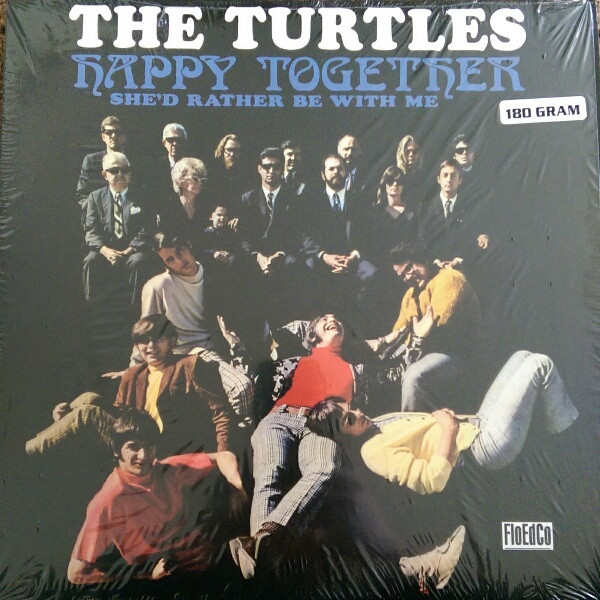

# Happy Together

By The Turtles

## Album Data

[Discogs URL](https://www.discogs.com/release/5769957-The-Turtles-Happy-Together)

- Label: Manifesto (2)
- Formats: Vinyl, LP, Album, Reissue
- Genres: Rock, Pop, Folk Rock, Psychedelic Rock, Pop Rock
- Rating: 4.26
- Released: 2013
- Year: 1967
- Release ID: 5769957
- Media condition: 
- Sleeve condition: 
- Speed: 
- Weight: 
- Notes: 

## Album Tracks

| **Position** | **Title** | **Duration** |
|--------------|-----------|--------------|
| A1 | **Makin' My Mind Up** | 2:20 |
| A2 | **Guide For The Married Man** | 2:59 |
| A3 | **Think I'll Run Away** | 2:15 |
| A4 | **The Walking Song** | 2:15 |
| A5 | **Me About You** | 2:27 |
| A6 | **Happy Together** | 2:50 |
| B1 | **She'd Rather Be With Me** | 2:17 |
| B2 | **Too Young To Be One** | 2:05 |
| B3 | **Person Without A Care** | 2:43 |
| B4 | **Like The Seasons** | 1:48 |
| B5 | **Rugs Of Woods & Flowers** | 3:00 |

## Artist Roles

| **Name** | **Role** |
|----------|----------|
| **Tom Wilkes (2)** | Artwork [Graphics] |
| **Jim Pons** | Bass Guitar, Vocals |
| **John Barbata** | Drums |
| **Armin Steiner** | Engineer |
| **Bruce Botnick** | Engineer |
| **Guy Webster** | Photography By |
| **Bones Howe** | Producer |
| **Joe Wissert** | Producer |
| **Jim Tucker (2)** | Rhythm Guitar |
| **Howard Kaylan** | Vocals |
| **Mark Volman** | Vocals, Effects [Special Effects] |
| **Al Nichol** | Vocals, Lead Guitar |

