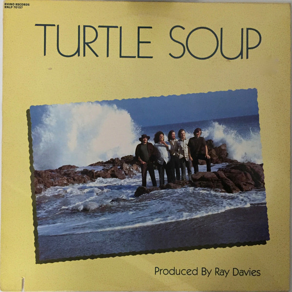

# Turtle Soup

By The Turtles

## Album Data

[Discogs URL](https://www.discogs.com/release/2035472-The-Turtles-Turtle-Soup)

- Label: White Whale
White Whale
- Formats: Vinyl, LP, Album, Stereo
- Genres: Rock, Pop, Psychedelic Rock, Pop Rock, Folk Rock
- Rating: 3.93
- Released: 1969
- Year: 1969
- Release ID: 2035472
- Media condition: 
- Sleeve condition: 
- Speed: 
- Weight: 
- Notes: 

## Album Tracks

| **Position** | **Title** | **Duration** |
|--------------|-----------|--------------|
| A1 | **Come Over** | 2:23 |
| A2 | **House On The Hill** | 2:55 |
| A3 | **She Always Leaves Me Laughing** | 2:45 |
| A4 | **How You Love Me** | 2:58 |
| A5 | **Torn Between Temptations** | 2:45 |
| A6 | **Love In The City** | 3:31 |
| B1 | **Bachelor Mother** | 2:38 |
| B2 | **John & Julie** | 3:07 |
| B3 | **Hot Little Hands** | 4:10 |
| B4 | **Somewhere Friday Night** | 3:27 |
| B5 | **Dance This Dance** | 4:25 |
| B6 | **You Don't Have To Walk In The Rain** | 2:27 |

## Artist Roles

| **Name** | **Role** |
|----------|----------|
| **Gary Burden** | Art Direction, Design |
| **Chuck Britz** | Engineer |
| **Henry Diltz** | Photography By |
| **Ray Davies** | Producer |
| **Al Nichol** | Songwriter |
| **Howard Kaylan** | Songwriter |
| **Jim Pons** | Songwriter |
| **John Seiter** | Songwriter |
| **Mark Volman** | Songwriter |
| **Ray Pohlman** | Strings, Horns |
| **Jim Pons** | Vocals, Bass, Guitar |
| **John Seiter** | Vocals, Drums, Piano |
| **Al Nichol** | Vocals, Guitar, Keyboards, Bass [6-String] |
| **Mark Volman** | Vocals, Guitar, Percussion |
| **Howard Kaylan** | Vocals, Percussion, Organ |

