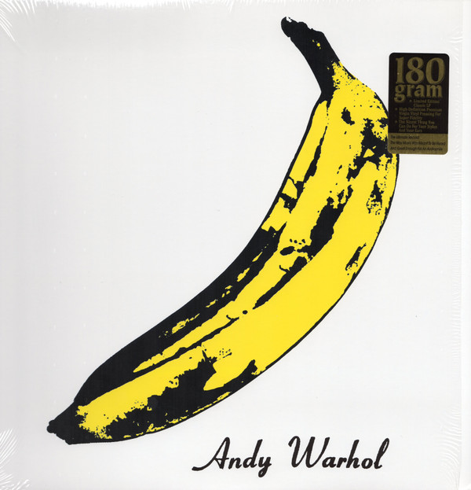

# The Velvet Underground & Nico

By The Velvet Underground

## Album Data

[Discogs URL](https://www.discogs.com/release/1219423-The-Velvet-Underground-Nico-The-Velvet-Underground-Nico)

- Label: Verve Records
Verve Records
Verve Records
- Formats: Vinyl, LP, Album, Limited Edition, Reissue, Stereo
- Genres: Rock, Psychedelic Rock, Garage Rock, Folk Rock, Experimental, Art Rock
- Rating: 4.63
- Released: 2000-03-00
- Year: 1967
- Release ID: 1219423
- Media condition: 
- Sleeve condition: 
- Speed: 
- Weight: 
- Notes: 

## Album Tracks

| **Position** | **Title** | **Duration** |
|--------------|-----------|--------------|
| A1 | **Sunday Morning** | 2:53 |
| A2 | **I'm Waiting For The Man** | 4:37 |
| A3 | **Femme Fatale** | 2:35 |
| A4 | **Venus In Furs** | 5:07 |
| A5 | **Run, Run, Run** | 4:18 |
| A6 | **All Tomorrow's Parties** | 5:55 |
| B1 | **Heroin** | 7:05 |
| B2 | **There She Goes Again** | 2:30 |
| B3 | **I'll Be Your Mirror** | 2:01 |
| B4 | **Black Angel's Death Song** | 3:10 |
| B5 | **European Son To Delmore Schwartz** | 7:44 |

## Artist Roles

| **Name** | **Role** |
|----------|----------|
| **Acy Lehman** | Design [Cover Design] |
| **David Cheppa** | Lacquer Cut By |
| **Lou Reed** | Lead Guitar, Guitar [Ostrich], Vocals |
| **Andy Warhol** | Painting [Cover Painting Banana] |
| **Moe Tucker** | Percussion |
| **Hugo (38)** | Photography By |
| **Paul Morrissey (2)** | Photography By |
| **Andy Warhol** | Producer |
| **Sterling Morrison** | Rhythm Guitar, Bass Guitar |
| **John Cale** | Viola [Electric], Piano, Bass Guitar |
| **Nico (3)** | Vocals [Chanteuse] |

