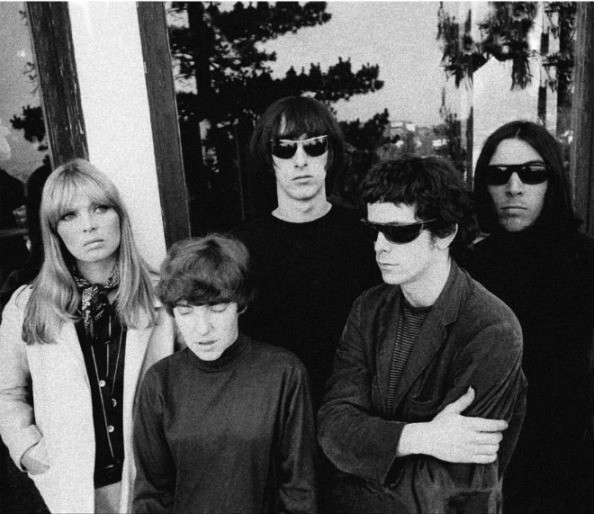

# The Velvet Underground

## Artist Profile

Rock 'n' roll group from New York. Known for Andy Warhol's artwork, often cited as one of the more important and influential groups of their era.

Inducted into Rock And Roll Hall of Fame in 1996 (Performer)

Original members:

Lou Reed (b. 2 March 1942 - d. 27 October 2013):
Vocals, Guitar, Piano

John Cale (b. 9 March 1942):
Vocals, Electric Viola, Organ, Bass Guitar

Sterling Morrison (b. 29 August 1942 - d. 30 August 1995):
Vocals, Guitar and Bass Guitar 

Maureen Tucker (b. 26 August 1944):
Percussion

Angus MacLise was the original drummer, but did not officially record with the band.

## Artist Links

- [https://www.velvetundergroundmusic.com/](https://www.velvetundergroundmusic.com/)
- [http://olivier.landemaine.free.fr/vu/index.html](http://olivier.landemaine.free.fr/vu/index.html)
- [https://en.wikipedia.org/wiki/The_Velvet_Underground](https://en.wikipedia.org/wiki/The_Velvet_Underground)
- [https://www.youtube.com/channel/UCXNWrugB_J3sRBYR9idQWzg](https://www.youtube.com/channel/UCXNWrugB_J3sRBYR9idQWzg)
- [https://www.last.fm/music/The+Velvet+Underground](https://www.last.fm/music/The+Velvet+Underground)
- [https://myspace.com/velvetunderground1969](https://myspace.com/velvetunderground1969)
- [https://www.rockhall.com/inductees/velvet-underground](https://www.rockhall.com/inductees/velvet-underground)
- [https://www.facebook.com/TheVelvetUnderground?rf=109883832364132](https://www.facebook.com/TheVelvetUnderground?rf=109883832364132)

## See also

- [The Velvet Underground & Nico](The_Velvet_Underground_and_Nico.md)
