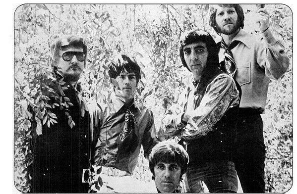

# The Ventures

## Artist Profile

American instrumental rock group formed in 1958 by Bob Bogle and Don Wilson in Tacoma, Washington. Inducted into Rock And Roll Hall of Fame in 2008 (Performer).

Line up:
1958 (as The Versatones):
Don Wilson (Rhythm Guitar)
Bob Bogle (Lead Guitar)

1959:
Don Wilson (Rhythm Guitar)
Bob Bogle (Lead Guitar)
Earl Herbert (Bass Guitar)
George T. Babbitt, Jr. (Drums)

1960 (Walk, Don't Run sessions):
Don Wilson (Rhythm Guitar)
Bob Bogle (Lead Guitar)
Nokie Edwards (Bass)
Skip Moore (Drums)

1960–1961:
Don Wilson (Rhythm Guitar)
Bob Bogle (Lead Guitar)
Nokie Edwards (Bass)
Howie Johnson (Drums)

1961–1962:
Don Wilson (Rhythm Guitar)
Bob Bogle (Bass Guitar)
Nokie Edwards (Lead Guitar)
Howie Johnson (Drums)

1963–1968:
Don Wilson (Rhythm Guitar)
Bob Bogle (Bass Guitar)
Nokie Edwards (Lead Guitar)
Mel Taylor (Drums)

1968–1969:
Don Wilson (Rhythm Guitar)
Bob Bogle (Bass Guitar)
Gerry McGee (Lead Guitar)
Mel Taylor (Drums)

1969–1972: 
Don Wilson (Rhythm Guitar)
Bob Bogle (Bass Guitar)
Gerry McGee (Lead Guitar)
Mel Taylor (Drums)
John Durrill (Keyboards)

1972:
Don Wilson (Rhythm Guitar)
Bob Bogle (Bass Guitar)
Nokie Edwards (Lead Guitar)
Mel Taylor (Drums)

1973–1979:
Don Wilson (Rhythm Guitar)
Bob Bogle (Bass Guitar)
Nokie Edwards (Lead Guitar)
Joe Barile (Drums)

1979–1984:
Don Wilson (Rhythm Guitar)
Bob Bogle (Bass Guitar)
Nokie Edwards (Lead Guitar)
Mel Taylor (Drums)

1985–1996:
Don Wilson (Rhythm Guitar)
Bob Bogle (Bass Guitar)
Gerry McGee (Lead Guitar)
Mel Taylor (Drums)

1996–2005:
 Don Wilson (Rhythm Guitar)
Bob Bogle (Bass Guitar)
Gerry McGee (Lead Guitar)
Leon Taylor (Drums, son of Mel Taylor)

2005–2009:
Don Wilson (Rhythm Guitar)
Bob Bogle (Bass Guitar)
Bob Spalding (Bass Guitar)
Gerry McGee (Lead Guitar)
Leon Taylor (Drums)
Nokie Edwards (Lead Guitar, as a special guest)

2009-2015:
Don Wilson (Rhythm Guitar)
Bob Spalding (Bass Guitar)
Gerry McGee (Lead Guitar)
Leon Taylor (Drums)
Nokie Edwards (Lead Guitar, as a special guest)

2016:
Don Wilson (Rhythm Guitar)
Bob Spalding (Rhythm Guitar)
Ian Spalding (Bass Guitar)
Gerry McGee (Lead Guitar)
Leon Taylor (Drums)

2017-present:
Bob Spalding (Lead Guitar)
Ian Spalding (Rhythm Guitar)
Luke Griffin (Bass Guitar)
Leon Taylor (Drums)

## Artist Links

- [https://www.theventures.com/](https://www.theventures.com/)
- [https://en.wikipedia.org/wiki/The_Ventures](https://en.wikipedia.org/wiki/The_Ventures)
- [https://www.imdb.com/name/nm0893394/](https://www.imdb.com/name/nm0893394/)

## See also

- [Walk Don't Run](Walk_Dont_Run.md)
