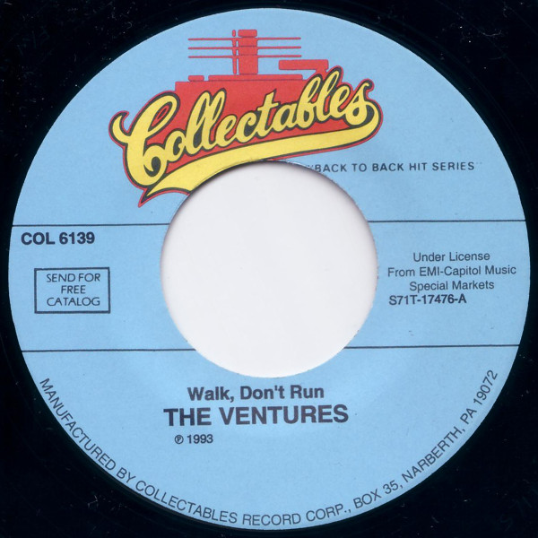

# Walk Don't Run

By The Ventures

## Album Data

[Discogs URL](https://www.discogs.com/release/4496024-The-Ventures-Walk-Dont-Run)

- Label: Sundazed Music
- Formats: Vinyl, LP, Album, Reissue, Remastered, Limited Edition
- Genres: Rock, Pop, Instrumental, Surf
- Rating: 4.4
- Released: 2013-02-00
- Year: 1960
- Release ID: 4496024
- Media condition: 
- Sleeve condition: 
- Speed: 
- Weight: 
- Notes: 

## Album Tracks

| **Position** | **Title** | **Duration** |
|--------------|-----------|--------------|
| A1 | **Morgen** | 2:12 |
| A2 | **Raunchy** | 2:21 |
| A3 | **Home** | 2:24 |
| A4 | **My Own True Love (Tara's Theme)** | 2:19 |
| A5 | **The Switch** | 2:03 |
| A6 | **Walk, Don't Run** | 2:08 |
| B1 | **Night Train** | 2:55 |
| B2 | **No Trespassing** | 2:03 |
| B3 | **Caravan** | 2:14 |
| B4 | **Sleep Walk** | 2:09 |
| B5 | **The McCoy** | 2:12 |
| B6 | **Honky Tonk** | 2:47 |

## Artist Roles

| **Name** | **Role** |
|----------|----------|
| **Pate/Francis & Associates** | Design [Cover] |
| **Joe Boles** | Engineer |
| **Garrett-Howard** | Photography By [Cover] |
| **Bob Reisdorff** | Producer |

