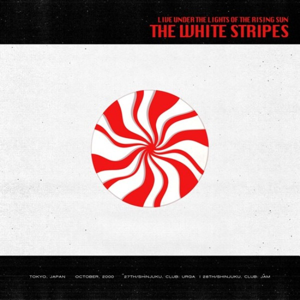

# Live Under The Lights Of The Rising Sun

By The White Stripes

## Album Data

[Discogs URL](https://www.discogs.com/release/6150884-The-White-Stripes-Live-Under-The-Lights-Of-The-Rising-Sun)

- Label: Third Man Records
- Formats: Vinyl
Vinyl
All Media, LP, LP, Limited Edition
- Genres: Rock, Blues, Blues Rock
- Rating: 4.35
- Released: 2014-10-00
- Year: 2014
- Release ID: 6150884
- Media condition: 
- Sleeve condition: 
- Speed: 
- Weight: 
- Notes: 

## Album Tracks

| **Position** | **Title** | **Duration** |
|--------------|-----------|--------------|
|  | **10.27.00 - Shinjuku, Club: Urga** |  |
| A1 | **Let's Shake Hands** | 2:02 |
| A2 | **When I Hear My Name** | 1:51 |
| A3 | **Jolene** | 3:30 |
| A4 | **Lord, Send Me An Angel** | 3:37 |
| A5 | **You're Pretty Good Looking** | 1:44 |
| A6 | **Hello Operator** | 2:19 |
| A7 | **Death Letter** | 4:24 |
| B1 | **Astro / I Walk Like Jayne Mansfield / Jack The Ripper** | 3:35 |
| B2 | **Canon / John The Revelator** | 2:42 |
| B3 | **Dead Leaves And The Dirty Ground** | 2:52 |
| B4 | **Apple Blossom** | 2:10 |
| B5 | **I Just Don't Know What To Do With Myself** | 2:53 |
| B6 | **Screwdriver** | 3:14 |
|  | **10.28.00 - Shinjuku, Club: Jam** |  |
| C1 | **Let's Shake Hands** | 1:58 |
| C2 | **When I Hear My Name** | 1:54 |
| C3 | **You're Pretty Good Looking** | 1:48 |
| C4 | **Hello Operator** | 2:28 |
| C5 | **Jolene** | 3:18 |
| C6 | **Apple Blossom** | 2:19 |
| C7 | **Stop Breaking Down** | 4:05 |
| D1 | **Death Letter** | 4:29 |
| D2 | **Wasting My Time** | 2:20 |
| D3 | **Broken Bricks** | 1:15 |
| D4 | **Cannon** | 2:27 |
| D5 | **Your Southern Can Is Mine** | 2:10 |
| D6 | **Dead Leaves And The Dirty Ground** | 2:54 |
| D7 | **I'm Bored** | 2:27 |
| D8 | **Screwdriver** | 3:08 |

## Artist Roles

| **Name** | **Role** |
|----------|----------|
| **Trent Thibodeaux** | Artwork |
| **Wes Garland** | Lacquer Cut By |
| **Masao Nakagami** | Photography By |

