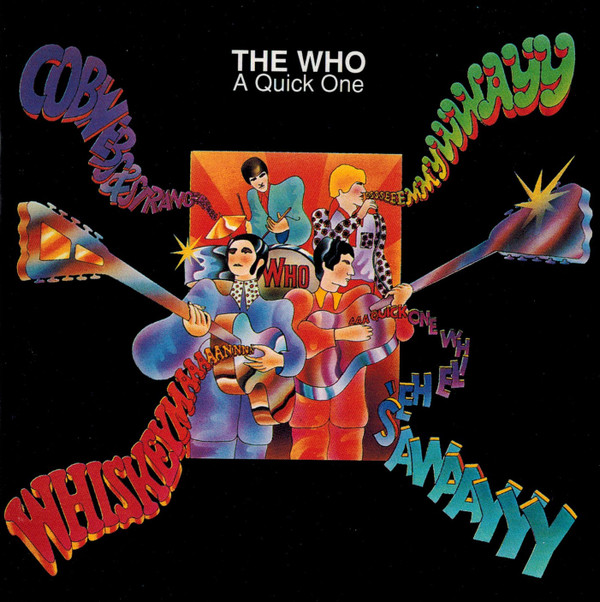

# A Quick One

By The Who

## Album Data

[Discogs URL](https://www.discogs.com/release/6811319-The-Who-A-Quick-One)

- Label: Geffen Records
- Formats: Vinyl, LP, Album, Reissue, Mono
- Genres: Rock, Mod, Rock Opera
- Rating: 4.17
- Released: 2015
- Year: 1966
- Release ID: 6811319
- Media condition: 
- Sleeve condition: 
- Speed: 
- Weight: 
- Notes: 

## Album Tracks

| **Position** | **Title** | **Duration** |
|--------------|-----------|--------------|
| A1 | **Run Run Run** |  |
| A2 | **Boris The Spider** |  |
| A3 | **I Need You** |  |
| A4 | **Whiskey Man** |  |
| A5 | **Heatwave** |  |
| A6 | **Cobwebs And Strange** |  |
| B1 | **Don't Look Away** |  |
| B2 | **See My Way** |  |
| B3 | **So Sad About Us** |  |
| B4 | **A Quick One, While He's Away** |  |

## Artist Roles

| **Name** | **Role** |
|----------|----------|
| **Alan Aldridge** | Design [Cover Design] |
| **Chris Stamp** | Executive-Producer |
| **Miles Showell** | Lacquer Cut By |
| **Kit Lambert** | Producer |

