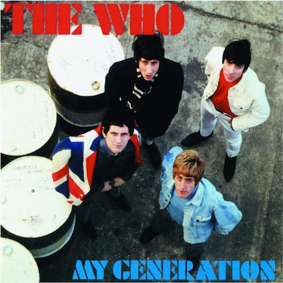

# My Generation

By The Who

## Album Data

[Discogs URL](https://www.discogs.com/release/6811303-The-Who-My-Generation)

- Label: Geffen Records
UMe
- Formats: Vinyl, LP, Album, Reissue, Mono
- Genres: Rock, Mod
- Rating: 4.41
- Released: 2015
- Year: 1965
- Release ID: 6811303
- Media condition: 
- Sleeve condition: 
- Speed: 
- Weight: 
- Notes: 

## Album Tracks

| **Position** | **Title** | **Duration** |
|--------------|-----------|--------------|
| A1 | **Out In The Street** |  |
| A2 | **I Don't Mind** |  |
| A3 | **The Good's Gone** |  |
| A4 | **La-La-La-Lies** |  |
| A5 | **Much Too Much** |  |
| A6 | **My Generation** |  |
| B1 | **The Kids Are Alright** |  |
| B2 | **Please, Please, Please** |  |
| B3 | **It's Not True** |  |
| B4 | **I'm A Man** |  |
| B5 | **A Legal Matter** |  |
| B6 | **The Ox** |  |

## Artist Roles

| **Name** | **Role** |
|----------|----------|
| **John Entwistle** | Bass Guitar |
| **David Wedgbury** | Cover [Photograph] |
| **Keith Moon** | Drums |
| **Miles Showell** | Lacquer Cut By |
| **Pete Townshend** | Lead Guitar |
| **Roger Daltrey** | Lead Vocals |

