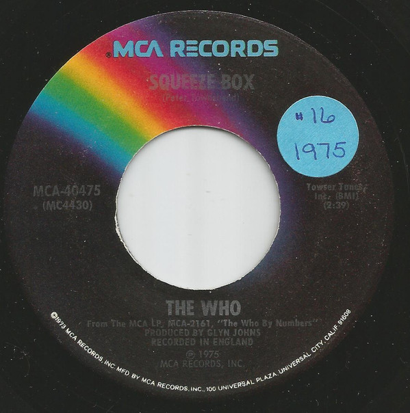

# Squeeze Box 

By The Who

## Album Data

[Discogs URL](https://www.discogs.com/release/6404000-The-Who-Squeeze-Box-)

- Label: MCA Records
- Formats: Vinyl, 7", 45 RPM, Single
- Genres: Rock, Pop, Classic Rock
- Rating: 4.2
- Released: 1975-11-00
- Year: 1975
- Release ID: 6404000
- Media condition: 
- Sleeve condition: 
- Speed: 
- Weight: 
- Notes: 

## Album Tracks

| **Position** | **Title** | **Duration** |
|--------------|-----------|--------------|
| A | **Squeeze Box** | 2:39 |
| B | **Success Story** | 3:20 |

## Artist Roles

| **Name** | **Role** |
|----------|----------|
| **Glyn Johns** | Producer |

