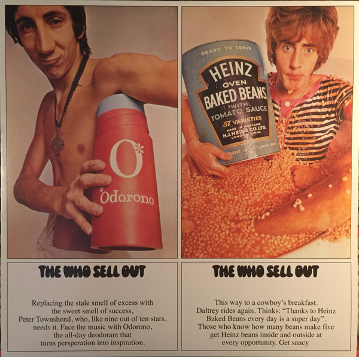

# The Who Sell Out

By The Who

## Album Data

[Discogs URL](https://www.discogs.com/release/6811330-The-Who-The-Who-Sell-Out)

- Label: Geffen Records
Track Record
- Formats: Vinyl, LP, Album, Reissue, Stereo
- Genres: Rock, Psychedelic Rock, Mod
- Rating: 4.28
- Released: 2015
- Year: 1967
- Release ID: 6811330
- Media condition: 
- Sleeve condition: 
- Speed: 
- Weight: 
- Notes: 

## Album Tracks

| **Position** | **Title** | **Duration** |
|--------------|-----------|--------------|
| A1 | **Armenia City In The Skies** |  |
| A2 | **Heinz Baked Beans** |  |
| A3 | **Mary Anne With The Shaky Hands** |  |
| A4 | **Odorono** |  |
| A5 | **Tattoo** |  |
| A6 | **Our Love Was** |  |
| A7 | **I Can See For Miles** |  |
| B1 | **Can't Reach You** |  |
| B2 | **Medac** |  |
| B3 | **Relax** |  |
| B4 | **Silas Stingy** |  |
| B5 | **Sunrise** |  |
| B6 | **Rael (1 And 2)** |  |

## Artist Roles

| **Name** | **Role** |
|----------|----------|
| **Adrian George** | Artwork [Poster] |
| **David King (7)** | Design [Cover] |
| **Roger Law** | Design [Cover] |
| **Chris Stamp** | Executive-Producer |
| **Miles Showell** | Lacquer Cut By |
| **David Montgomery (4)** | Photography By |
| **Kit Lambert** | Producer |

