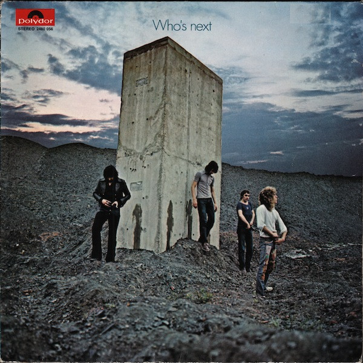

# Who's Next

By The Who

## Album Data

[Discogs URL](https://www.discogs.com/release/6166905-The-Who-Whos-Next)

- Label: MCA Records
- Formats: Vinyl, LP, Album, Club Edition, Reissue, Stereo
- Genres: Rock, Hard Rock, Classic Rock
- Rating: 4.23
- Released: 1973
- Year: 1971
- Release ID: 6166905
- Media condition: 
- Sleeve condition: 
- Speed: 
- Weight: 
- Notes: 

## Album Tracks

| **Position** | **Title** | **Duration** |
|--------------|-----------|--------------|
| A1 | **Baba O'Riley** | 4:59 |
| A2 | **Bargain** | 5:33 |
| A3 | **Love Ain't For Keeping** | 2:11 |
| A4 | **My Wife** | 3:35 |
| A5 | **Song Is Over** | 6:16 |
| B1 | **Getting In Tune** | 4:49 |
| B2 | **Going Mobile** | 3:40 |
| B3 | **Behind Blue Eyes** | 3:40 |
| B4 | **Won't Get Fooled Again** | 8:31 |

## Artist Roles

| **Name** | **Role** |
|----------|----------|
| **John Entwistle** | Bass, Brass, Vocals |
| **John Kosh** | Design |
| **Keith Moon** | Drums, Percussion |
| **Chris Stamp** | Executive-Producer |
| **Kit Lambert** | Executive-Producer |
| **Pete Kameron** | Executive-Producer |
| **Pete Townshend** | Guitar, Organ [Vcs3], Synthesizer [A.r.p.], Vocals |
| **Ethan Russell** | Photography By |
| **Nicky Hopkins** | Piano |
| **The Who** | Producer |
| **Glyn Johns** | Recorded By, Mixed By, Co-producer |
| **Roger Daltrey** | Vocals |
| **John Entwistle** | Written-By |
| **Pete Townshend** | Written-By |

