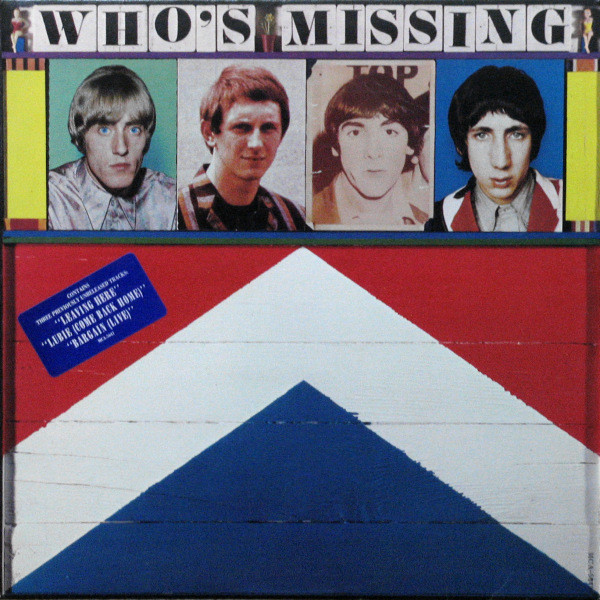

# Who's Missing

By The Who

## Album Data

[Discogs URL](https://www.discogs.com/release/6580287-The-Who-Whos-Missing)

- Label: MCA Records
- Formats: Vinyl, LP, Compilation
- Genres: Rock, Hard Rock, Mod
- Rating: 4
- Released: 1985
- Year: 1985
- Release ID: 6580287
- Media condition: 
- Sleeve condition: 
- Speed: 
- Weight: 
- Notes: 

## Album Tracks

| **Position** | **Title** | **Duration** |
|--------------|-----------|--------------|
| A1 | **Shout And Shimmy** | 3:16 |
| A2 | **Leaving Here** | 2:49 |
| A3 | **Anytime You Want Me** | 2:35 |
| A4 | **Lubie (Come Back Home)** | 3:38 |
| A5 | **Barbara Ann** | 2:00 |
| A6 | **I'm A Boy (1st Version)** | 2:36 |
| A7 | **Mary-Anne With The Shaky Hands (Original Version)** | 3:16 |
| B1 | **Heaven And Hell** | 3:33 |
| B2 | **Here For More** | 2:25 |
| B3 | **I Don't Even Know Myself** | 5:00 |
| B4 | **When I Was A Boy** | 3:29 |
| B5 | **Bargain (Live)** | 6:22 |

## Artist Roles

| **Name** | **Role** |
|----------|----------|
| **Steve Hoffman** | Compiled By, Remastered By |
| **Richard Evans (7)** | Design [Sleeve], Painting [Front Cover] |
| **Greg Fulginiti** | Engineer [Cutting] |
| **Pete Townshend** | Liner Notes |

