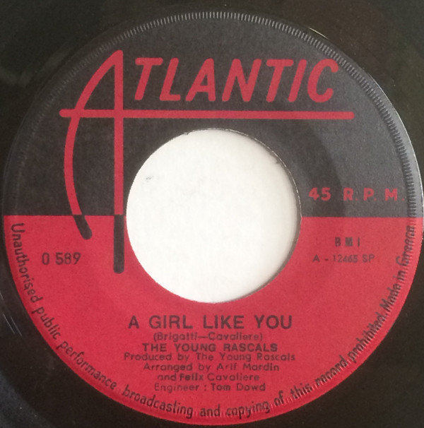

# A Girl Like You / It's Love

By The Young Rascals

## Album Data

[Discogs URL](https://www.discogs.com/release/810302-The-Young-Rascals-A-Girl-Like-You-Its-Love)

- Label: Atlantic
- Formats: Vinyl, 7", 45 RPM, Single
- Genres: Rock, Classic Rock
- Rating: 3.83
- Released: 1967-07-03
- Year: 1967
- Release ID: 810302
- Media condition: 
- Sleeve condition: 
- Speed: 
- Weight: 
- Notes: 

## Album Tracks

| **Position** | **Title** | **Duration** |
|--------------|-----------|--------------|
| A | **A Girl Like You** | 2:46 |
| B | **It's Love** | 3:10 |

## Artist Roles

| **Name** | **Role** |
|----------|----------|
| **The Young Rascals** | Producer |
| **Eddie Brigati** | Written-By |
| **Felix Cavaliere** | Written-By |

