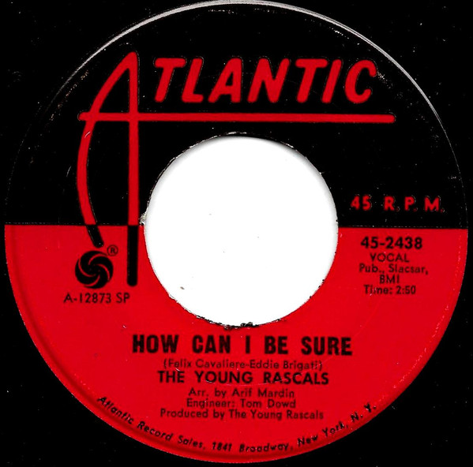

# How Can I Be Sure

By The Young Rascals

## Album Data

[Discogs URL](https://www.discogs.com/release/1332403-The-Young-Rascals-How-Can-I-Be-Sure)

- Label: Atlantic
- Formats: Vinyl, 7", Single, 45 RPM
- Genres: Rock, Pop Rock
- Rating: 3.63
- Released: 1967-08-24
- Year: 1967
- Release ID: 1332403
- Media condition: 
- Sleeve condition: 
- Speed: 
- Weight: 
- Notes: 

## Album Tracks

| **Position** | **Title** | **Duration** |
|--------------|-----------|--------------|
| A | **How Can I Be Sure** | 2:50 |
| B | **I'm So Happy Now** | 2:46 |

## Artist Roles

| **Name** | **Role** |
|----------|----------|
| **Arif Mardin** | Arranged By |
| **Tom Dowd** | Engineer |
| **The Young Rascals** | Producer |

