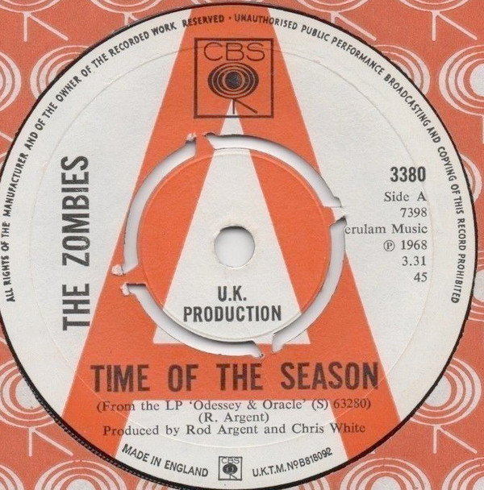

# Time Of The Season

By The Zombies

## Album Data

[Discogs URL](https://www.discogs.com/release/589824-The-Zombies-Time-Of-The-Season)

- Label: Date
- Formats: Vinyl, 7", 45 RPM, Single, Styrene
- Genres: Rock, Pop, Psychedelic Rock, Pop Rock
- Rating: 4.48
- Released: 1968
- Year: 1968
- Release ID: 589824
- Media condition: 
- Sleeve condition: 
- Speed: 
- Weight: 
- Notes: 

## Album Tracks

| **Position** | **Title** | **Duration** |
|--------------|-----------|--------------|
| A | **Time Of The Season** | 3:32 |
| B | **Friends Of Mine** | 2:16 |

## Artist Roles

| **Name** | **Role** |
|----------|----------|
| **Chris White (2)** | Producer |
| **Rod Argent** | Producer |

