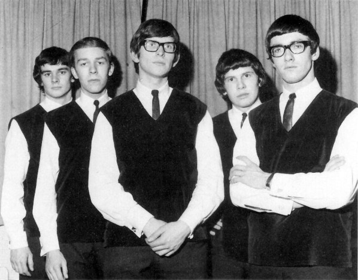

# The Zombies

## Artist Profile

English rock band founded in 1962 in St Albans, Herts, England.
Inducted into the Rock and Roll Hall of Fame in 2019.

Rod Argent: Keyboards, Vocals
Paul Atkinson: Guitars
Chris White: Bass, Vocals
Colin Blunstone: Lead Vocals
Hugh Grundy: Drums

Current line-up:
Colin Blunstone: Lead Vocals
Rod Argent: Keyboards, Vocals
Tom Toomey: Guitars, Vocals
Søren Koch: Bass, Vocals
Steve Rodford: Drums

## Artist Links

- [https://www.facebook.com/thezombiesmusic](https://www.facebook.com/thezombiesmusic)
- [https://twitter.com/thezombiesmusic](https://twitter.com/thezombiesmusic)
- [https://instagram.com/thezombiesofficial](https://instagram.com/thezombiesofficial)
- [https://www.youtube.com/thezombies](https://www.youtube.com/thezombies)
- [https://soundcloud.com/the-zombies-official](https://soundcloud.com/the-zombies-official)
- [https://en.wikipedia.org/wiki/The_Zombies](https://en.wikipedia.org/wiki/The_Zombies)

## See also

- [Time Of The Season](Time_Of_The_Season.md)
