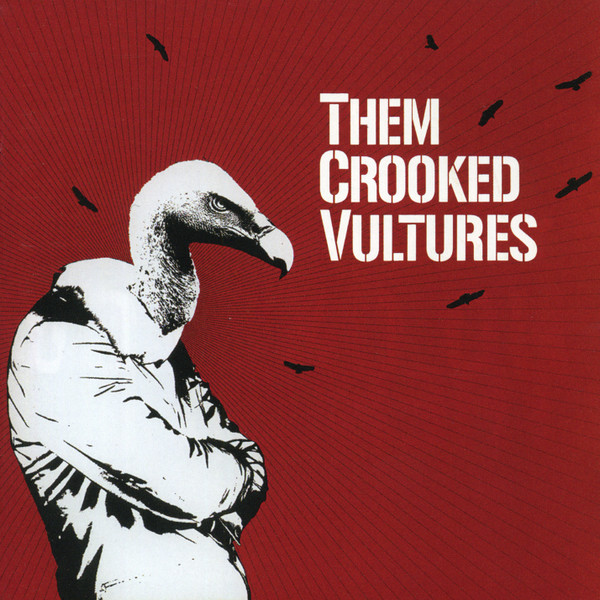

# Them Crooked Vultures

By Them Crooked Vultures

## Album Data

[Discogs URL](https://www.discogs.com/release/2016236-Them-Crooked-Vultures-Them-Crooked-Vultures)

- Label: DGC
Interscope Records
- Formats: Vinyl, LP, Album, Stereo
- Genres: Rock, Alternative Rock
- Rating: 4.47
- Released: 2009-11-17
- Year: 2009
- Release ID: 2016236
- Media condition: 
- Sleeve condition: 
- Speed: 
- Weight: 
- Notes: 

## Album Tracks

| **Position** | **Title** | **Duration** |
|--------------|-----------|--------------|
| A1 | **No One Loves Me & Neither Do I** | 5:10 |
| A2 | **Mind Eraser, No Chaser** | 4:07 |
| A3 | **New Fang** | 3:49 |
| A4 | **Dead End Friends** | 3:17 |
| B1 | **Elephants** | 6:50 |
| B2 | **Scumbag Blues** | 4:27 |
| B3 | **Bandoliers** | 5:42 |
| C1 | **Reptiles** | 4:16 |
| C2 | **Interlude With Ludes** | 3:44 |
| C3 | **Warsaw Or The First Breath You Take After You Give Up** | 7:52 |
| D1 | **Caligulove** | 4:56 |
| D2 | **Gunman** | 4:47 |
| D3 | **Spinning In Daffodils** | 7:27 |

## Artist Roles

| **Name** | **Role** |
|----------|----------|
| **Morning Breath Inc.** | Art Direction |
| **Liam Lynch** | Graphics, Artwork |
| **Brian Gardner** | Mastered By |
| **Mike Bozzi** | Mastered By [Assisted By] |
| **Chris Kasych** | Mixed By [Assisted By] |
| **Dave Grohl** | Musician [Them Crooked Vultures Is] |
| **John Paul Jones** | Musician [Them Crooked Vultures Is] |
| **Josh Homme** | Musician [Them Crooked Vultures Is] |
| **Them Crooked Vultures** | Producer |
| **Alain Johannes** | Recorded By |
| **Alain Johannes** | Recorded By [Additional Vocals] |
| **Justin Smith (51)** | Recorded By [Assisted By] |
| **Alan Moulder** | Recorded By, Mixed By |
| **Gersh** | Technician [Drums For Drumfetish] |
| **Alastair Christie** | Technician [Everything Else] |
| **Them Crooked Vultures** | Written-By |

