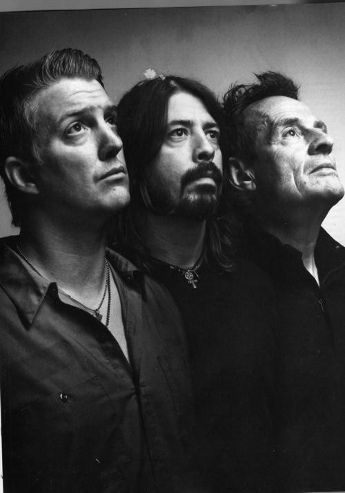

# Them Crooked Vultures

## Artist Profile

Them Crooked Vultures is an alternative rock supergroup formed in Los Angeles in 2009 by Josh Homme (of Queens of the Stone Age and Kyuss) on lead vocals and guitar, John Paul Jones (of Led Zeppelin) on bass and keyboards, and Dave Grohl (of Foo Fighters and Nirvana) on drums and backing vocals. The group also includes guitarist Alain Johannes during live performances.

## Artist Links

- [http://www.themcrookedvultures.com/](http://www.themcrookedvultures.com/)
- [http://en.wikipedia.org/wiki/Them_Crooked_Vultures](http://en.wikipedia.org/wiki/Them_Crooked_Vultures)
- [https://genius.com/artists/Them-crooked-vultures](https://genius.com/artists/Them-crooked-vultures)
- [https://www.setlist.fm/setlists/them-crooked-vultures-3bd4e028.html](https://www.setlist.fm/setlists/them-crooked-vultures-3bd4e028.html)

## See also

- [Them Crooked Vultures](Them_Crooked_Vultures.md)
