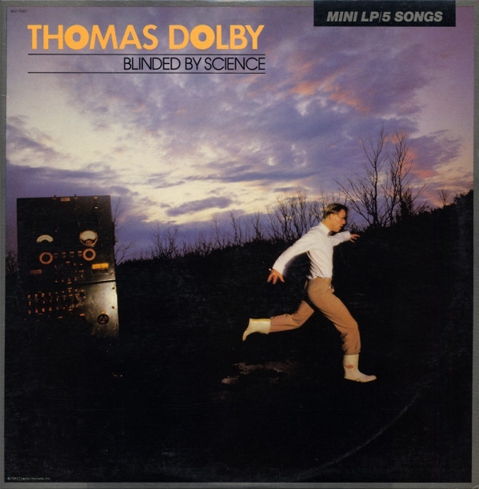

# Blinded By Science

By Thomas Dolby

## Album Data

[Discogs URL](https://www.discogs.com/release/59731-Thomas-Dolby-Blinded-By-Science)

- Label: Harvest
Venice In Peril Records
- Formats: Vinyl, LP, Mini-Album
- Genres: Electronic, Rock, Synth-pop, New Wave
- Rating: 4.13
- Released: 1983-01-00
- Year: 1983
- Release ID: 59731
- Media condition: 
- Sleeve condition: 
- Speed: 
- Weight: 
- Notes: 

## Album Tracks

| **Position** | **Title** | **Duration** |
|--------------|-----------|--------------|
| A1 | **She Blinded Me With Science** | 5:09 |
| A2 | **One Of Our Submarines** | 7:18 |
| B1 | **Windpower** | 5:51 |
| B2 | **Airwaves** | 5:20 |
| B3 | **Flying North** | 5:36 |

## Artist Roles

| **Name** | **Role** |
|----------|----------|
| **Bruce Woolley** | Backing Vocals |
| **John Marsh** | Backing Vocals |
| **Kevin Armstrong** | Backing Vocals |
| **Lesley Fairbairn** | Backing Vocals |
| **Miriam Stockley** | Backing Vocals |
| **Robert John Lange** | Backing Vocals |
| **Shipping Forecast** | Backing Vocals |
| **Mark Heyward-Chaplin** | Bass Guitar |
| **Simon Lloyd** | Brass, Flute |
| **Thomas Dolby** | Computer [Wave Computer], Drum Programming [Drum Programs], Lead Vocals |
| **Justin Hildreth** | Drums |
| **Kevin Armstrong** | Electric Guitar |
| **Dave Birch** | Guitar |
| **Eddy Schreyer** | Mastered By |
| **Andrew Douglas** | Photography By |
| **Thomas Dolby** | Producer |
| **Thomas Dolby** | Producer |
| **Tim Friese-Greene** | Producer |
| **Matthew Seligman** | Synthesizer [Bass Synthesizer] |
| **Simon House** | Violin |
| **Dr. M. Pyke** | Voice [Voice Over] |

